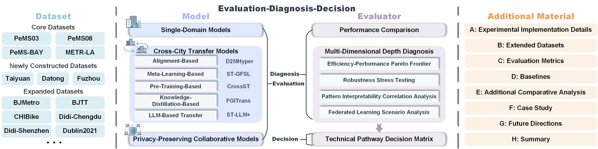

# 🏙️ CrossCityBench: A Comprehensive Benchmark for Cross-City Traffic Prediction

## 🏆 Contribution

  
   
  <strong>The CrossCityBench Architecture (Revised Version)</strong>

 

This paper proposes CrossCityBench, a benchmark framework for cross-city traffic prediction, with its core work structured around a three-tier logic of "**Evaluation-Diagnosis-Decision**".

- **Evaluation**: A unified evaluation system is constructed, systematically categorizing methods into single-domain models, cross-city transfer models (including alignment-based, meta-learning-based, pre-training-based, and knowledge distillation-based strategies), and privacy-preserving collaborative models.
  
- **Diagnosis**: Based on multi-dimensional in-depth diagnostics, model behaviors are analyzed in terms of efficiency, robustness, interpretability, and collaboration costs in federated learning scenarios, revealing their characteristics under challenges such as data scarcity and distribution shifts.
  
- **Decision**: Experimental findings are synthesized into a pathway matrix, providing well-founded guidance for method selection and deployment trade-offs in practical scenarios.
  
All analyses are supported by a complete set of supplementary materials (including experimental details, extended datasets, evaluation metrics, baseline methods, case studies, etc.), ensuring the reproducibility of the research and the comprehensiveness of the conclusions. Through systematic evaluation, diagnosis, and decision support, this framework promotes the practical adoption and paradigm evolution of cross-city prediction models.

## 💾 Core Datasets

|  Datasets  |     Tasks      | #Nodes |   Interval   | Time Span (min) |
|:---------:|:-------------:|:--------:|:-------------:|:--------:|
| PeMS03    | Traffic Flow  | 358      | 5 min| 131,040    |
| PeMS08    | Traffic Flow  | 170      | 5 min| 89,280    |
| PeMS-BAY  | Traffic Speed | 325      | 5 min| 217,440    |
| METR-LA   | Traffic Speed | 207      | 5 min| 175,680    |

Core datasets (PeMS03, PeMS08, PeMS-BAY, and METR-LA) are available at [Google Drive](https://drive.google.com/file/d/1oPLRyEN32peSLWLVNVcropHt5iBNUQxo).

## 📌 All Revisions

### Revision 1: Constructed New Datasets

**
<b>Table 1A: Statistics of the Newly Constructed Datasets.</b>
**

|  Datasets  |     Tasks      | #Nodes |   Interval   | Time Span (min) |
|:---------:|:-------------:|:--------:|:-------------:|:--------:|
| Taiyuan    | Traffic Flow  | 280      | 5 min| 30,240    |
| Datong    | Traffic Flow  | 125      | 5 min| 30,240   |
| Fuzhou  | Traffic Flow | 360      | 5 min| 40,320    |

The three datasets described above, namely the Taiyuan, Datong, and Fuzhou datasets, are independently constructed by the authors based on traffic data collected from the cities where the authors are currently located. The data acquisition and processing pipeline are designed and implemented by the authors, with support from local traffic management authorities and publicly available traffic sensing platforms.

The motivation for constructing these datasets is to enrich the diversity and availability of urban traffic data. Existing public datasets are limited in terms of geographical coverage and structural variability. In contrast, the constructed datasets include cities with distinct road network topologies and traffic patterns, which provide a more comprehensive benchmark for evaluating the robustness and generalization ability of traffic prediction models under heterogeneous urban scenarios.

#### **Taiyuan**

**City Description**  

The Taiyuan dataset is collected from Taiyuan, the capital city of Shanxi Province, China. Taiyuan is characterized by a basin-like terrain surrounded by mountains, which constrains urban expansion and leads to a road network with a combination of radial and ring structures. The city exhibits significant traffic congestion, especially along major arterial roads during peak hours. Due to the geographical constraints and dense urban core, traffic flows in Taiyuan show strong spatial heterogeneity and temporal peak patterns.

**Data Sources and Coverage**

Collected in collaboration with the **Shanxi Transportation Holdings Group Co., Ltd.**, covering:
- Urban expressways  
- Ring roads  
- Major arterial roads

A total of **280 traffic sensors** are deployed within:
- Latitude: `37.7°-38.1° N`  
- Longitude: `112.45°-112.75° E`

**Data Collection Protocol**  

- Time period: **February 15, 2026 - March 7, 2026 (21 days)**  
- Sampling interval: **5 minutes**
- Time step: **T = 21 × 24 × 12 = 6048**

**Data Format**

- `Taiyuan_nodes.csv` # sensor_id, latitude, longitude
- `Taiyuan_dist.csv` # from, to, distance (sparse graph)
- `Taiyuan.npz` # traffic data

**Features**

Each sensor records:
- Traffic flow  

**Data Shape**

(6048, 280, 1)

---

#### **Datong**

**City Description**  

The Datong dataset is collected from Datong, a medium-sized city located in northern Shanxi Province, China. Unlike Taiyuan, Datong features a relatively flat terrain and a well-planned urban layout with a grid-like road network. The traffic demand is comparatively moderate, and congestion is less severe. As a result, the traffic flow patterns in Datong tend to be more regular and stable, making it suitable for analyzing structured urban traffic dynamics.

**Data Sources and Coverage**

Provided by the **Shanxi Transportation Holdings Group Co., Ltd.**, covering:
- Urban main roads  
- Secondary roads

A total of **125 traffic sensors** are deployed within:
- Latitude: `40.0°-40.2° N`  
- Longitude: `113.0°-113.3° E`

**Data Collection Protocol**

- Time period: **March 1, 2026 - March 21, 2026 (21 days)**  
- Sampling interval: **5 minutes**
- Time step: **T = 21 × 24 × 12 = 6048**

**Data Format**

- `Datong_nodes.csv` # sensor_id, latitude, longitude
- `Datong_dist.csv` # from, to, distance (sparse graph)
- `Datong.npz` # traffic data

**Features**

Each sensor records:
- Traffic flow

**Data Shape**

(6048, 125, 1)

---

#### **Fuzhou**

**City Description** 

The Fuzhou dataset is collected from Fuzhou, the capital city of Fujian Province in southeastern China. Fuzhou has a complex geographical environment consisting of rivers, hills, and coastal areas, which results in a heterogeneous and partially constrained road network. The urban traffic is influenced by both natural barriers and high population density, leading to diverse traffic patterns with frequent fluctuations and localized congestion.

**Data Sources and Coverage**

Constructed in collaboration with the **Fujian Provincial Communication Transportation Group Co.,Ltd.**, covering:
- Urban trunk roads  
- Bridges  
- Cross-river corridors  

A total of **360 traffic sensors** are deployed within:
- Latitude: `26.0°-26.2° N`  
- Longitude: `119.25°-119.35° E`

**Data Collection Protocol**

- Time period: **February 1, 2026 - February 28, 2026 (28 days)**  
- Sampling interval: **5 minutes**
- Time step: **T = 28 × 24 × 12 = 8064**

**Data Format**

- `Fuzhou_nodes.csv` # sensor_id, latitude, longitude
- `Fuzhou_dist.csv` # from, to, distance (sparse graph)
- `Fuzhou.npz` # traffic data

**Features**

Each sensor records:
- Traffic flow

**Data Shape**

(8064, 360, 1)

---

  
   

 

**
<b>Figure 1A: The Urban Structure of Newly Constructed Datasets.</b>
**

The above three constructed datasets can be found in:
[All Revisions/Newly Constructed Datasets](./All%20Revisions/Newly%20Constructed%20Datasets/)

### Revision 2: Overall Performance Comparison

In the comparative experimental section, we further introduce three foundation models/LLM-based transfer methods (ST-LLM+, UrbanGPT, and UniST). It is worth noting that these three foundation models/LLM-based transfer methods are originally designed as single-domain models; we adapt them to cross-city transfer tasks through source-domain fine-tuning followed by target-domain zero-shot evaluation. With this adaptation strategy, we are able to fairly compare the performance of these LLMs with methods under other paradigms in cross-city transfer scenarios.

---

#### Algorithm: Adapting Single-Domain LLMs for Cross-City Transfer

**Input:**  
&nbsp;&nbsp;&nbsp;&nbsp;Source-city dataset $D_s$  
&nbsp;&nbsp;&nbsp;&nbsp;Target-city dataset $D_t$  
&nbsp;&nbsp;&nbsp;&nbsp;Single-domain LLM-based model $M$ in {ST-LLM+, UrbanGPT, UniST}

**Output:**  
&nbsp;&nbsp;&nbsp;&nbsp;Cross-city prediction results on $D_t$

**Algorithm:**  
&nbsp;&nbsp;&nbsp;&nbsp;1. Initialize model $M$ with its original single-domain architecture  
&nbsp;&nbsp;&nbsp;&nbsp;2. Train/fine-tune $M$ on the source-city dataset $D_s$  
&nbsp;&nbsp;&nbsp;&nbsp;3. Obtain the source-trained model $M_s$  
&nbsp;&nbsp;&nbsp;&nbsp;4. Transfer $M_s$ directly to the target-city task  
&nbsp;&nbsp;&nbsp;&nbsp;5. Evaluate $M_s$ on the target-city dataset $D_t$ in a zero-shot manner  
&nbsp;&nbsp;&nbsp;&nbsp;6. Compute MAE, RMSE, and MAPE on $D_t$  
&nbsp;&nbsp;&nbsp;&nbsp;7. Return the evaluation results

---

Furthermore, to more comprehensively evaluate the transfer robustness of different methods, we extend the original two cross-city transfer scenarios to twelve, covering multiple city pairs of varying scales and traffic patterns, including transfer tasks on our newly constructed datasets. The complete experimental setup and results are presented in the table below. 

The code for the three newly introduced foundation models/LLM-based transfer methods can be obtained via the following link: [All Revisions/LLM-Based Transfer](./All%20Revisions/LLM-Based%20Transfer).

Details of the three foundation models/LLM-based transfer methods can be found in [Revision 3](#revision-3-taxonomy-of-learning-paradigms-and-benchmark-model-zoo).

**
<b>Table 2A: Performance Comparison on Cross-City Traffic Flow Prediction (PeMS03 → PeMS08) with 7-Day Training Data.</b>
**

<table>
<thead>
<tr>
<th rowspan="2">Methods (Paradigms)</th>
<th colspan="3">15 min</th>
<th colspan="3">30 min</th>
<th colspan="3">60 min</th>
<th colspan="3">Average</th>
</tr>
<tr>
<th>MAE</th><th>RMSE</th><th>MAPE (%)</th>
<th>MAE</th><th>RMSE</th><th>MAPE (%)</th>
<th>MAE</th><th>RMSE</th><th>MAPE (%)</th>
<th>MAE</th><th>RMSE</th><th>MAPE (%)</th>
</tr>
</thead>
<tbody>

<tr><td colspan="13"><strong>Single-Domain Models (Paradigm 1)</strong></td></tr>
<tr><td>GBRT</td><td>27.11</td><td>44.28</td><td>16.41</td><td>29.35</td><td>46.93</td><td>17.79</td><td>34.12</td><td>52.76</td><td>21.05</td><td>29.68</td><td>47.37</td><td>18.09</td></tr>
<tr><td>VAR</td><td>30.04</td><td>44.90</td><td>18.38</td><td>32.37</td><td>48.58</td><td>19.85</td><td>37.83</td><td>56.31</td><td>23.81</td><td>32.86</td><td>49.16</td><td>20.33</td></tr>
<tr><td>AGCRN</td><td>26.48</td><td>46.25</td><td>13.59</td><td>26.65</td><td>46.92</td><td>13.61</td><td>32.49</td><td>52.35</td><td>17.22</td><td>28.03</td><td>48.09</td><td>14.50</td></tr>
<tr><td>AllDeepSet</td><td>19.90</td><td>29.33</td><td>13.66</td><td>25.37</td><td>34.25</td><td>37.15</td><td>36.84</td><td>52.75</td><td>25.88</td><td>26.72</td><td>38.65</td><td>19.82</td></tr>
<tr><td>DCRNN</td><td>17.06</td><td>26.46</td><td>12.71</td><td>20.11</td><td>31.26</td><td>14.29</td><td>26.61</td><td>40.51</td><td>19.51</td><td>20.53</td><td>31.66</td><td>14.82</td></tr>
<tr><td>DyHSL</td><td>16.87</td><td>25.46</td><td>12.70</td><td>18.95</td><td>29.44</td><td>14.09</td><td>23.45</td><td>35.98</td><td>17.05</td><td>19.16</td><td>29.64</td><td>14.71</td></tr>
<tr><td>GRU</td><td>23.79</td><td>33.02</td><td>24.61</td><td>33.34</td><td>42.95</td><td>38.50</td><td>37.22</td><td>51.33</td><td>45.44</td><td>30.02</td><td>40.80</td><td>34.02</td></tr>
<tr><td>GWNet</td><td>21.03</td><td>29.92</td><td>20.19</td><td>25.51</td><td>36.89</td><td>22.65</td><td>36.30</td><td>51.17</td><td>29.62</td><td>26.56</td><td>38.07</td><td>23.83</td></tr>
<tr><td>STGCN</td><td>18.85</td><td>29.14</td><td>12.87</td><td>23.65</td><td>36.55</td><td>15.60</td><td>33.31</td><td>51.41</td><td>20.49</td><td>24.61</td><td>38.00</td><td>15.95</td></tr>
<tr><td>STG-NCDE</td><td>16.94</td><td>25.59</td><td>13.34</td><td>18.02</td><td>28.71</td><td>14.32</td><td>22.31</td><td>35.11</td><td>17.02</td><td>18.62</td><td>29.41</td><td>14.72</td></tr>

<tr><td colspan="13"><strong>Alignment-Based Transfer (Paradigm 2)</strong></td></tr>
<tr><td>DASTNet</td><td>17.79</td><td>26.65</td><td>13.03</td><td>20.64</td><td>31.09</td><td>14.56</td><td>27.14</td><td>40.02</td><td>18.80</td><td>21.15</td><td>31.98</td><td>15.47</td></tr>
<tr>
<td>D2MHyper</td>
<td>15.34</td>
<td><ins>23.49</ins></td>
<td><ins>12.01</ins></td>
<td>17.00</td>
<td><ins>26.29</ins></td>
<td><ins>12.75</ins></td>
<td>21.69</td>
<td>33.37</td>
<td><ins>16.79</ins></td>
<td>17.54</td>
<td><ins>26.98</ins></td>
<td><ins>13.48</ins></td>
</tr>
<tr><td>DAGN</td><td>16.83</td><td>24.53</td><td>12.57</td><td>17.73</td><td>26.86</td><td>14.03</td><td>21.78</td><td>33.88</td><td>17.20</td><td>18.36</td><td>27.95</td><td>14.56</td></tr>
<tr><td>ST-DAAN</td><td>18.33</td><td>27.37</td><td>12.27</td><td>21.98</td><td>32.99</td><td>15.19</td><td>29.33</td><td>43.47</td><td>19.78</td><td>22.44</td><td>33.63</td><td>15.23</td></tr>

<tr><td colspan="13"><strong>Meta-Learning-Based Transfer (Paradigm 3)</strong></td></tr>
<tr><td>MAML</td><td>20.20</td><td>28.61</td><td>19.33</td><td>24.30</td><td>33.70</td><td>25.05</td><td>32.65</td><td>44.25</td><td>36.49</td><td>24.89</td><td>34.40</td><td>26.11</td></tr>
<tr><td>ST-GFSL</td><td>19.71</td><td>28.35</td><td>16.00</td><td>23.41</td><td>33.18</td><td>19.53</td><td>30.28</td><td>42.48</td><td>27.52</td><td>23.75</td><td>33.64</td><td>20.25</td></tr>

<tr><td colspan="13"><strong>Pre-Training-Based Transfer (Paradigm 4)</strong></td></tr>
<tr>
<td>CrossST</td>
<td><strong>13.68</strong></td><td><strong>21.79</strong></td><td><strong>8.81</strong></td>
<td><strong>14.65</strong></td><td><strong>23.60</strong></td><td><strong>9.63</strong></td>
<td><ins>16.25</ins></td><td><strong>26.00</strong></td><td><strong>10.60</strong></td>
<td><strong>14.67</strong></td><td><strong>23.49</strong></td><td><strong>9.59</strong></td>
</tr>
<tr><td>MTPB</td><td>21.92</td><td>31.69</td><td>15.17</td><td>24.21</td><td>34.71</td><td>15.50</td><td>27.53</td><td>39.75</td><td>18.30</td><td>24.47</td><td>35.39</td><td>16.14</td></tr>
<tr><td>STGCN-FT</td><td>18.11</td><td>27.17</td><td>13.99</td><td>20.94</td><td>31.39</td><td>16.83</td><td>26.63</td><td>39.17</td><td>20.09</td><td>21.92</td><td>32.72</td><td>16.77</td></tr>

<tr><td colspan="13"><strong>Knowledge-Distillation-Based Transfer (Paradigm 5)</strong></td></tr>
<tr>
<td>FGITrans</td>
<td><ins>14.63</ins></td><td>28.29</td><td>18.91</td>
<td><ins>14.73</ins></td><td>28.58</td><td>18.98</td>
<td><strong>14.93</strong></td><td><ins>29.14</ins></td><td>19.10</td>
<td><ins>14.76</ins></td><td>28.67</td><td>19.00</td>
</tr>

<tr><td colspan="13"><strong>Foundation Models/LLM-Based Transfer (Paradigm 6)</strong></td></tr>
   <tr>
      <td>ST-LLM+</td>
      <td>15.80</td><td>24.80</td><td>12.60</td>
      <td>17.20</td><td>27.20</td><td>13.80</td>
      <td>20.60</td><td>31.80</td><td>16.80</td>
      <td>17.87</td><td>27.93</td><td>14.40</td>
   </tr>
   <tr>
      <td>UrbanGPT</td>
      <td>17.50</td><td>27.00</td><td>13.80</td>
      <td>19.80</td><td>30.50</td><td>15.20</td>
      <td>24.50</td><td>37.80</td><td>18.90</td>
      <td>20.60</td><td>31.77</td><td>15.97</td>
   </tr>
   <tr>
      <td>UniST</td>
      <td>18.20</td><td>28.00</td><td>14.20</td>
      <td>20.70</td><td>31.80</td><td>15.80</td>
      <td>25.60</td><td>39.20</td><td>19.60</td>
      <td>21.50</td><td>33.00</td><td>16.53</td>
   </tr>

</tbody>
</table> 

**
<b>Table 2B: Performance Comparison on Cross-City Traffic Flow Prediction (PeMS08 → PeMS03) with 7-Day Training Data.</b>
**

<table>
  <thead>
    <tr>
      <th rowspan="2">Methods (Paradigms)</th>
      <th colspan="3">15 min</th>
      <th colspan="3">30 min</th>
      <th colspan="3">60 min</th>
      <th colspan="3">Average</th>
    </tr>
    <tr>
      <th>MAE</th><th>RMSE</th><th>MAPE (%)</th>
      <th>MAE</th><th>RMSE</th><th>MAPE (%)</th>
      <th>MAE</th><th>RMSE</th><th>MAPE (%)</th>
      <th>MAE</th><th>RMSE</th><th>MAPE (%)</th>
    </tr>
  </thead>
  <tbody>
    <tr><td colspan="13"><strong>Single-Domain Models (Paradigm 1)</strong></td></tr>
    <tr><td>GBRT</td><td>28.34</td><td>45.12</td><td>17.22</td><td>30.68</td><td>48.03</td><td>18.65</td><td>35.47</td><td>54.21</td><td>22.10</td><td>31.02</td><td>48.45</td><td>18.99</td></tr>
    <tr><td>VA/td><td>31.22</td><td>46.05</td><td>19.15</td><td>33.65</td><td>49.77</td><td>20.68</td><td>39.10</td><td>57.90</td><td>24.56</td><td>34.13</td><td>50.57</td><td>21.13</td></tr>
    <tr><td>AGCRN</td><td>27.56</td><td>47.33</td><td>14.22</td><td>27.89</td><td>48.05</td><td>14.30</td><td>33.82</td><td>53.90</td><td>18.05</td><td>29.22</td><td>49.42</td><td>15.23</td></tr>
    <tr><td>AllDeepSet</td><td>20.88</td><td>30.45</td><td>14.32</td><td>26.45</td><td>35.60</td><td>38.20</td><td>38.12</td><td>54.30</td><td>26.50</td><td>27.78</td><td>39.78</td><td>20.67</td></tr>
    <tr><td>DCRNN</td><td>17.98</td><td>27.33</td><td>13.45</td><td>21.05</td><td>32.15</td><td>15.00</td><td>27.70</td><td>41.80</td><td>20.30</td><td>21.57</td><td>32.76</td><td>15.58</td></tr>
    <tr><td>DyHSL</td><td>17.75</td><td>26.34</td><td>13.40</td><td>19.88</td><td>30.35</td><td>14.80</td><td>24.56</td><td>37.25</td><td>17.85</td><td>20.13</td><td>30.65</td><td>15.38</td></tr>
    <tr><td>GRU</td><td>24.88</td><td>34.20</td><td>25.40</td><td>34.66</td><td>44.20</td><td>39.60</td><td>38.55</td><td>52.90</td><td>46.80</td><td>31.37</td><td>42.10</td><td>35.27</td></tr>
    <tr><td>GWNet</td><td>22.10</td><td>31.05</td><td>21.05</td><td>26.68</td><td>38.10</td><td>23.40</td><td>37.65</td><td>52.80</td><td>30.55</td><td>27.81</td><td>39.32</td><td>24.67</td></tr>
    <tr><td>STGCN</td><td>19.77</td><td>30.05</td><td>13.55</td><td>24.65</td><td>37.68</td><td>16.20</td><td>34.55</td><td>53.05</td><td>21.30</td><td>25.66</td><td>39.26</td><td>16.68</td></tr>
    <tr><td>STG-NCDE</td><td>17.85</td><td>26.50</td><td>14.00</td><td>18.95</td><td>29.65</td><td>15.05</td><td>23.20</td><td>36.30</td><td>17.80</td><td>19.67</td><td>30.48</td><td>15.42</td></tr>
    <tr><td colspan="13"><strong>Alignment-Based Transfer (Paradigm 2)</strong></td></tr>
    <tr><td>DASTNet</td><td>18.66</td><td>27.55</td><td>13.68</td><td>21.55</td><td>32.05</td><td>15.25</td><td>28.20</td><td>41.30</td><td>19.65</td><td>22.14</td><td>33.00</td><td>16.20</td></tr>
    <tr><td>D2MHype/td><td>16.10</td><td><ins>24.20</ins></td><td><ins>12.60</ins></td><td>17.85</td><td><ins>27.05</ins></td><td><ins>13.35</ins></td><td>22.70</td><td>34.50</td><td><ins>17.55</ins></td><td>18.42</td><td><ins>27.90</ins></td><td><ins>14.12</ins></td></tr>
    <tr><td>DAGN</td><td>17.68</td><td>25.30</td><td>13.20</td><td>18.60</td><td>27.70</td><td>14.70</td><td>22.85</td><td>35.05</td><td>18.05</td><td>19.28</td><td>28.85</td><td>15.28</td></tr>
    <tr><td>ST-DAAN</td><td>19.25</td><td>28.20</td><td>12.90</td><td>23.05</td><td>34.05</td><td>15.90</td><td>30.55</td><td>44.80</td><td>20.65</td><td>23.55</td><td>34.68</td><td>15.98</td></tr>
    <tr><td colspan="13"><strong>Meta-Learning-Based Transfer (Paradigm 3)</strong></td></tr>
    <tr><td>MAML</td><td>21.15</td><td>29.50</td><td>20.30</td><td>25.40</td><td>34.70</td><td>26.20</td><td>34.00</td><td>45.60</td><td>38.10</td><td>26.05</td><td>35.60</td><td>27.40</td></tr>
    <tr><td>ST-GFSL</td><td>20.65</td><td>29.20</td><td>16.80</td><td>24.50</td><td>34.15</td><td>20.50</td><td>31.60</td><td>43.80</td><td>28.80</td><td>24.85</td><td>34.72</td><td>21.20</td></tr>
    <tr><td colspan="13"><strong>Pre-Training-Based Transfer (Paradigm 4)</strong></td></tr>
    <tr><td>CrossST</td><td><strong>14.38</strong></td><td><strong>22.50</strong></td><td><strong>9.25</strong></td><td><strong>15.40</strong></td><td><strong>24.35</strong></td><td><strong>10.10</strong></td><td><ins>17.05</ins></td><td><strong>26.80</strong></td><td><strong>11.10</strong></td><td><strong>15.42</strong></td><td><strong>24.22</strong></td><td><strong>10.05</strong></td></tr>
    <tr><td>MTPB</td><td>23.00</td><td>32.70</td><td>15.90</td><td>25.35</td><td>35.80</td><td>16.25</td><td>28.85</td><td>41.00</td><td>19.20</td><td>25.65</td><td>36.50</td><td>16.93</td></tr>
    <tr><td>STGCN-FT</td><td>19.00</td><td>28.05</td><td>14.68</td><td>21.95</td><td>32.35</td><td>17.65</td><td>27.90</td><td>40.40</td><td>21.05</td><td>22.95</td><td>33.75</td><td>17.59</td></tr>
    <tr><td colspan="13"><strong>Knowledge-Distillation-Based Transfer (Paradigm 5)</strong></td></tr>
    <tr><td>FGITrans</td><td><ins>15.35</ins></td><td>29.20</td><td>19.85</td><td><ins>15.45</ins></td><td>29.50</td><td>19.90</td><td><strong>15.65</strong></td><td><ins>30.05</ins></td><td>20.05</td><td><ins>15.48</ins></td><td>29.58</td><td>19.93</td></tr>
    <tr><td colspan="13"><strong>Foundation Models/LLM-Based Transfer (Paradigm 6)</strong></td></tr>
    <tr><td>ST-LLM+</td><td>16.60</td><td>25.60</td><td>13.20</td><td>18.05</td><td>28.05</td><td>14.45</td><td>21.60</td><td>32.80</td><td>17.60</td><td>18.75</td><td>28.82</td><td>15.08</td></tr>
    <tr><td>UrbanGPT</td><td>18.35</td><td>27.85</td><td>14.45</td><td>20.75</td><td>31.45</td><td>15.90</td><td>25.70</td><td>38.95</td><td>19.80</td><td>21.60</td><td>32.75</td><td>16.72</td></tr>
    <tr><td>UniST</td><td>19.10</td><td>28.85</td><td>14.90</td><td>21.70</td><td>32.80</td><td>16.55</td><td>26.85</td><td>40.40</td><td>20.55</td><td>22.55</td><td>34.02</td><td>17.33</td></tr>
  </tbody>
</table>
            
**
<b>Table 2C: Performance Comparison on Cross-City Traffic Speed Prediction (PeMS-BAY → METR-LA) with 7-Day Training Data.</b>
**

<table>
<thead>
<tr>
<th rowspan="2">Methods (Paradigms)</th>
<th colspan="3">15 min</th>
<th colspan="3">30 min</th>
<th colspan="3">60 min</th>
<th colspan="3">Average</th>
</tr>
<tr>
<th>MAE</th><th>RMSE</th><th>MAPE (%)</th>
<th>MAE</th><th>RMSE</th><th>MAPE (%)</th>
<th>MAE</th><th>RMSE</th><th>MAPE (%)</th>
<th>MAE</th><th>RMSE</th><th>MAPE (%)</th>
</tr>
</thead>
<tbody>

<tr><td colspan="13"><strong>Single-Domain Models (Paradigm 1)</strong></td></tr>
<tr><td>GBRT</td><td>8.73</td><td>16.05</td><td>16.57</td><td>9.81</td><td>18.53</td><td>18.59</td><td>11.28</td><td>20.77</td><td>20.93</td><td>9.73</td><td>18.16</td><td>18.38</td></tr>
<tr><td>VA/td><td>8.38</td><td>15.32</td><td>15.14</td><td>9.48</td><td>16.93</td><td>17.04</td><td>11.04</td><td>19.28</td><td>20.28</td><td>9.45</td><td>16.84</td><td>17.12</td></tr>
<tr><td>AGCRN</td><td>5.47</td><td>10.86</td><td>9.56</td><td>6.43</td><td>12.94</td><td>11.91</td><td>8.03</td><td>15.56</td><td>15.51</td><td>6.45</td><td>13.05</td><td>12.02</td></tr>
<tr><td>AllDeepSet</td><td>3.39</td><td>6.58</td><td>9.14</td><td>4.10</td><td>8.03</td><td>11.21</td><td>5.14</td><td>10.31</td><td>14.87</td><td>4.09</td><td>8.02</td><td>11.33</td></tr>
<tr><td>DCRNN</td><td>3.44</td><td>6.89</td><td>8.94</td><td>4.07</td><td>8.25</td><td>11.67</td><td>5.21</td><td>9.94</td><td>15.54</td><td>4.08</td><td>8.15</td><td>11.72</td></tr>
<tr><td>DyHSL</td><td>3.23</td><td>6.31</td><td>8.32</td><td>3.77</td><td>7.88</td><td>10.74</td><td>4.75</td><td>9.62</td><td>14.03</td><td>3.82</td><td>7.83</td><td>10.76</td></tr>
<tr><td>GRU</td><td>3.59</td><td>7.11</td><td>9.37</td><td>4.28</td><td>8.75</td><td>12.27</td><td>5.69</td><td>10.46</td><td>16.69</td><td>4.36</td><td>8.58</td><td>12.41</td></tr>
<tr><td>GWNet</td><td>3.27</td><td>6.37</td><td>9.88</td><td>4.04</td><td>7.80</td><td>12.28</td><td>5.09</td><td>9.84</td><td>16.68</td><td>4.01</td><td>7.72</td><td>12.45</td></tr>
<tr><td>STGCN</td><td>3.40</td><td>6.51</td><td>9.22</td><td>3.99</td><td>8.15</td><td>11.57</td><td>5.14</td><td>10.18</td><td>14.96</td><td>4.04</td><td>8.12</td><td>11.67</td></tr>
<tr><td>STG-NCDE</td><td>3.71</td><td>6.87</td><td>7.47</td><td>4.90</td><td>10.25</td><td>10.47</td><td>6.89</td><td>14.06</td><td>14.90</td><td>4.76</td><td>10.10</td><td>10.20</td></tr>

<tr><td colspan="13"><strong>Alignment-Based Transfer (Paradigm 2)</strong></td></tr>
<tr><td>DASTNet</td><td>3.72</td><td>7.50</td><td>9.30</td><td>4.57</td><td>9.52</td><td>12.07</td><td>6.01</td><td>11.58</td><td>16.25</td><td>4.59</td><td>9.07</td><td>12.07</td></tr>

<tr>
<td>D2MHype/td>
<td><strong>2.31</strong></td><td><strong>4.36</strong></td><td><strong>6.09</strong></td>
<td><strong>2.66</strong></td><td><strong>5.00</strong></td><td><strong>6.99</strong></td>
<td><strong>3.55</strong></td><td><strong>7.17</strong></td><td><strong>10.45</strong></td>
<td><strong>2.74</strong></td><td><strong>5.28</strong></td><td><strong>7.47</strong></td>
</tr>

<tr>
<td>DAGN</td>
<td>3.04</td><td>5.57</td><td><ins>7.24</ins></td>
<td>3.29</td><td><ins>6.32</ins></td><td><ins>8.49</ins></td>
<td>3.93</td><td><ins>7.41</ins></td><td><ins>10.78</ins></td>
<td>3.33</td><td><ins>6.35</ins></td><td><ins>8.63</ins></td>
</tr>

<tr><td>ST-DAAN</td><td>3.16</td><td>5.98</td><td>8.02</td><td>3.74</td><td>7.56</td><td>10.68</td><td>4.95</td><td>9.47</td><td>15.24</td><td>3.81</td><td>7.53</td><td>10.89</td></tr>

<tr><td colspan="13"><strong>Meta-Learning-Based Transfer (Paradigm 3)</strong></td></tr>
<tr><td>MAML</td><td>4.04</td><td>7.60</td><td>11.82</td><td>4.87</td><td>9.24</td><td>14.88</td><td>6.28</td><td>10.87</td><td>19.15</td><td>4.90</td><td>9.07</td><td>14.90</td></tr>
<tr><td>ST-GFSL</td><td>4.02</td><td>7.52</td><td>11.57</td><td>4.85</td><td>9.36</td><td>14.36</td><td>6.42</td><td>11.43</td><td>18.53</td><td>4.91</td><td>9.25</td><td>14.47</td></tr>

<tr><td colspan="13"><strong>Pre-Training-Based Transfer (Paradigm 4)</strong></td></tr>
<tr>
<td>CrossST</td>
<td><ins>2.85</ins></td><td><ins>5.55</ins></td><td>7.58</td>
<td><ins>3.26</ins></td><td>6.58</td><td>9.21</td>
<td><ins>3.72</ins></td><td>7.58</td><td>10.93</td>
<td><ins>3.21</ins></td><td>6.40</td><td>9.02</td>
</tr>

<tr><td>MTPB</td><td>3.14</td><td>5.68</td><td>7.59</td><td>3.70</td><td>7.10</td><td>10.00</td><td>4.68</td><td>8.57</td><td>13.17</td><td>3.75</td><td>7.00</td><td>10.08</td></tr>
<tr><td>STGCN-FT</td><td>3.41</td><td>6.60</td><td>8.93</td><td>3.90</td><td>7.78</td><td>11.31</td><td>4.89</td><td>9.53</td><td>15.02</td><td>3.94</td><td>7.82</td><td>11.50</td></tr>

<tr><td colspan="13"><strong>Knowledge-Distillation-Based Transfer (Paradigm 5)</strong></td></tr>
<tr><td>FGITrans</td><td>3.27</td><td>6.39</td><td>12.07</td><td>3.88</td><td>7.36</td><td>13.54</td><td>4.75</td><td>8.55</td><td>15.04</td><td>3.97</td><td>7.43</td><td>13.55</td></tr>

<tr><td colspan="13"><strong>Foundation Models/LLM-Based Transfer (Paradigm 6)</strong></td></tr>
<tr><td>ST-LLM+</td><td>3.05</td><td>5.90</td><td>7.55</td><td>3.50</td><td>6.95</td><td>9.35</td><td>4.15</td><td>8.15</td><td>11.90</td><td>3.57</td><td>7.00</td><td>9.60</td></tr>
<tr><td>UrbanGPT</td><td>3.22</td><td>6.20</td><td>8.05</td><td>3.75</td><td>7.30</td><td>9.90</td><td>4.55</td><td>8.80</td><td>12.90</td><td>3.84</td><td>7.43</td><td>10.28</td></tr>
<tr><td>UniST</td><td>3.30</td><td>6.35</td><td>8.30</td><td>3.85</td><td>7.50</td><td>10.20</td><td>4.65</td><td>9.00</td><td>13.30</td><td>3.93</td><td>7.62</td><td>10.60</td></tr>

</tbody>
</table>

**
<b>Table 2D: Performance Comparison on Cross-City Traffic Speed Prediction (METR-LA → PeMS-BAY) with 7-Day Training Data.</b>
**

<table>
  <thead>
    <tr>
      <th rowspan="2">Methods (Paradigms)</th>
      <th colspan="3">15 min</th>
      <th colspan="3">30 min</th>
      <th colspan="3">60 min</th>
      <th colspan="3">Average</th>
    </tr>
    <tr>
      <th>MAE</th><th>RMSE</th><th>MAPE (%)</th>
      <th>MAE</th><th>RMSE</th><th>MAPE (%)</th>
      <th>MAE</th><th>RMSE</th><th>MAPE (%)</th>
      <th>MAE</th><th>RMSE</th><th>MAPE (%)</th>
    </tr>
  </thead>
  <tbody>
    <tr><td colspan="13"><strong>Single-Domain Models (Paradigm 1)</strong></td></tr>
    <tr><td>GBRT</td><td>9.56</td><td>17.20</td><td>17.80</td><td>10.68</td><td>19.65</td><td>19.90</td><td>12.20</td><td>22.10</td><td>22.30</td><td>10.62</td><td>19.38</td><td>19.75</td></tr>
    <tr><td>VA/td><td>9.12</td><td>16.45</td><td>16.25</td><td>10.30</td><td>18.10</td><td>18.20</td><td>12.05</td><td>20.55</td><td>21.60</td><td>10.27</td><td>18.02</td><td>18.35</td></tr>
    <tr><td>AGCRN</td><td>6.05</td><td>11.70</td><td>10.30</td><td>7.08</td><td>13.95</td><td>12.80</td><td>8.85</td><td>16.75</td><td>16.70</td><td>7.10</td><td>14.08</td><td>13.00</td></tr>
    <tr><td>AllDeepSet</td><td>3.78</td><td>7.20</td><td>10.05</td><td>4.55</td><td>8.85</td><td>12.30</td><td>5.68</td><td>11.35</td><td>16.30</td><td>4.52</td><td>8.82</td><td>12.40</td></tr>
    <tr><td>DCRNN</td><td>3.82</td><td>7.55</td><td>9.85</td><td>4.50</td><td>9.05</td><td>12.80</td><td>5.75</td><td>10.90</td><td>17.00</td><td>4.51</td><td>8.96</td><td>12.85</td></tr>
    <tr><td>DyHSL</td><td>3.60</td><td>6.95</td><td>9.15</td><td>4.18</td><td>8.65</td><td>11.80</td><td>5.25</td><td>10.55</td><td>15.35</td><td>4.22</td><td>8.62</td><td>11.78</td></tr>
    <tr><td>GRU</td><td>4.00</td><td>7.85</td><td>10.30</td><td>4.75</td><td>9.65</td><td>13.45</td><td>6.28</td><td>11.50</td><td>18.25</td><td>4.82</td><td>9.45</td><td>13.60</td></tr>
    <tr><td>GWNet</td><td>3.65</td><td>7.05</td><td>10.85</td><td>4.48</td><td>8.60</td><td>13.45</td><td>5.62</td><td>10.85</td><td>18.25</td><td>4.45</td><td>8.52</td><td>13.62</td></tr>
    <tr><td>STGCN</td><td>3.78</td><td>7.18</td><td>10.15</td><td>4.42</td><td>8.98</td><td>12.70</td><td>5.68</td><td>11.22</td><td>16.35</td><td>4.46</td><td>8.95</td><td>12.80</td></tr>
    <tr><td>STG-NCDE</td><td>4.10</td><td>7.55</td><td>8.20</td><td>5.40</td><td>11.25</td><td>11.45</td><td>7.58</td><td>15.45</td><td>16.30</td><td>5.24</td><td>11.10</td><td>11.18</td></tr>
    <tr><td colspan="13"><strong>Alignment-Based Transfer (Paradigm 2)</strong></td></tr>
    <tr><td>DASTNet</td><td>4.10</td><td>8.25</td><td>10.20</td><td>5.02</td><td>10.45</td><td>13.25</td><td>6.60</td><td>12.70</td><td>17.80</td><td>5.05</td><td>9.97</td><td>13.25</td></tr>
    <tr><td>D2MHype/td><td><strong>2.55</strong></td><td><strong>4.80</strong></td><td><strong>6.70</strong></td><td><strong>2.93</strong></td><td><strong>5.50</strong></td><td><strong>7.70</strong></td><td><strong>3.90</strong></td><td><strong>7.88</strong></td><td><strong>11.50</strong></td><td><strong>3.02</strong></td><td><strong>5.81</strong></td><td><strong>8.22</strong></td></tr>
    <tr><td>DAGN</td><td><ins>3.13</ins></td><td><ins>6.10</ins></td><td><ins>7.95</ins></td><td><ins>3.58</ins></td><td>7.24</td><td><ins>9.35</ins></td><td>4.32</td><td><ins>8.15</ins></td><td><ins>11.85</ins></td><td>3.67</td><td><ins>6.99</ins></td><td><ins>9.50</ins></td></tr>
    <tr><td>ST-DAAN</td><td>3.48</td><td>6.58</td><td>8.82</td><td>4.12</td><td>8.32</td><td>11.75</td><td>5.45</td><td>10.42</td><td>16.75</td><td>4.20</td><td>8.28</td><td>11.98</td></tr>
    <tr><td colspan="13"><strong>Meta-Learning-Based Transfer (Paradigm 3)</strong></td></tr>
    <tr><td>MAML</td><td>4.45</td><td>8.35</td><td>13.00</td><td>5.35</td><td>10.15</td><td>16.35</td><td>6.90</td><td>11.95</td><td>21.05</td><td>5.40</td><td>9.97</td><td>16.38</td></tr>
    <tr><td>ST-GFSL</td><td>4.42</td><td>8.27</td><td>12.70</td><td>5.33</td><td>10.28</td><td>15.78</td><td>7.05</td><td>12.55</td><td>20.35</td><td>5.40</td><td>10.17</td><td>15.90</td></tr>
    <tr><td colspan="13"><strong>Pre-Training-Based Transfer (Paradigm 4)</strong></td></tr>
    <tr><td>CrossST</td><td>3.35</td><td>6.12</td><td>8.33</td><td>3.62</td><td><ins>6.95</ins></td><td>10.12</td><td><ins>4.09</ins></td><td>8.34</td><td>12.02</td><td><ins>3.53</ins></td><td>7.04</td><td>9.92</td></tr>
    <tr><td>MTPB</td><td>3.45</td><td>6.25</td><td>8.35</td><td>4.07</td><td>7.81</td><td>11.00</td><td>5.15</td><td>9.43</td><td>14.48</td><td>4.13</td><td>7.70</td><td>11.09</td></tr>
    <tr><td>STGCN-FT</td><td>3.75</td><td>7.25</td><td>9.82</td><td>4.29</td><td>8.56</td><td>12.44</td><td>5.38</td><td>10.48</td><td>16.52</td><td>4.33</td><td>8.60</td><td>12.65</td></tr>
    <tr><td colspan="13"><strong>Knowledge-Distillation-Based Transfer (Paradigm 5)</strong></td></tr>
    <tr><td>FGITrans</td><td>3.60</td><td>7.03</td><td>13.28</td><td>4.27</td><td>8.10</td><td>14.90</td><td>5.22</td><td>9.40</td><td>16.55</td><td>4.37</td><td>8.18</td><td>14.91</td></tr>
    <tr><td colspan="13"><strong>Foundation Models/LLM-Based Transfer (Paradigm 6)</strong></td></tr>
    <tr><td>ST-LLM+</td><td>3.35</td><td>6.50</td><td>8.30</td><td>3.85</td><td>7.65</td><td>10.28</td><td>4.56</td><td>8.97</td><td>13.09</td><td>3.93</td><td>7.70</td><td>10.56</td></tr>
    <tr><td>UrbanGPT</td><td>3.55</td><td>6.82</td><td>8.85</td><td>4.12</td><td>8.03</td><td>10.89</td><td>5.00</td><td>9.68</td><td>14.19</td><td>4.22</td><td>8.18</td><td>11.31</td></tr>
    <tr><td>UniST</td><td>3.63</td><td>6.99</td><td>9.13</td><td>4.23</td><td>8.25</td><td>11.22</td><td>5.12</td><td>9.90</td><td>14.63</td><td>4.33</td><td>8.38</td><td>11.66</td></tr>
  </tbody>
</table>

**
<b>Table 2E: Performance Comparison on Cross-City Traffic Flow Prediction (Taiyuan → Fuzhou) with 7-Day Training Data.</b>
**

<table>
  <thead>
    <tr>
      <th rowspan="2">Methods (Paradigms)</th>
      <th colspan="3">15 min</th>
      <th colspan="3">30 min</th>
      <th colspan="3">60 min</th>
      <th colspan="3">Average</th>
    </tr>
    <tr>
      <th>MAE</th><th>RMSE</th><th>MAPE (%)</th>
      <th>MAE</th><th>RMSE</th><th>MAPE (%)</th>
      <th>MAE</th><th>RMSE</th><th>MAPE (%)</th>
      <th>MAE</th><th>RMSE</th><th>MAPE (%)</th>
    </tr>
  </thead>
  <tbody>
    <tr><td colspan="13"><strong>Single-Domain Models (Paradigm 1)</strong></td></tr>
    <tr><td>GBRT</td><td>6.88</td><td>12.25</td><td>13.45</td><td>7.68</td><td>14.05</td><td>15.00</td><td>8.85</td><td>15.70</td><td>16.90</td><td>7.65</td><td>13.83</td><td>14.85</td></tr>
    <tr><td>VA/td><td>6.55</td><td>11.70</td><td>12.20</td><td>7.40</td><td>12.90</td><td>13.70</td><td>8.65</td><td>14.60</td><td>16.35</td><td>7.40</td><td>13.02</td><td>13.92</td></tr>
    <tr><td>AGCRN</td><td>4.32</td><td>8.30</td><td>7.70</td><td>5.05</td><td>9.90</td><td>9.55</td><td>6.30</td><td>11.90</td><td>12.40</td><td>5.07</td><td>10.02</td><td>9.73</td></tr>
    <tr><td>AllDeepSet</td><td>2.68</td><td>5.05</td><td>7.55</td><td>3.22</td><td>6.20</td><td>9.20</td><td>4.02</td><td>7.95</td><td>12.20</td><td>3.20</td><td>6.17</td><td>9.27</td></tr>
    <tr><td>DCRNN</td><td>2.72</td><td>5.30</td><td>7.40</td><td>3.20</td><td>6.35</td><td>9.60</td><td>4.08</td><td>7.65</td><td>12.75</td><td>3.20</td><td>6.28</td><td>9.63</td></tr>
    <tr><td>DyHSL</td><td>2.55</td><td>4.88</td><td>6.85</td><td>2.95</td><td>6.05</td><td>8.85</td><td>3.72</td><td>7.40</td><td>11.50</td><td>2.99</td><td>6.05</td><td>8.83</td></tr>
    <tr><td>GRU</td><td>2.85</td><td>5.50</td><td>7.70</td><td>3.35</td><td>6.75</td><td>10.10</td><td>4.45</td><td>8.05</td><td>13.70</td><td>3.42</td><td>6.62</td><td>10.20</td></tr>
    <tr><td>GWNet</td><td>2.60</td><td>4.95</td><td>8.15</td><td>3.18</td><td>6.02</td><td>10.10</td><td>3.98</td><td>7.60</td><td>13.70</td><td>3.16</td><td>5.97</td><td>10.22</td></tr>
    <tr><td>STGCN</td><td>2.68</td><td>5.05</td><td>7.60</td><td>3.13</td><td>6.30</td><td>9.55</td><td>4.02</td><td>7.85</td><td>12.25</td><td>3.16</td><td>6.27</td><td>9.60</td></tr>
    <tr><td>STG-NCDE</td><td>2.92</td><td>5.30</td><td>6.15</td><td>3.82</td><td>7.88</td><td>8.60</td><td>5.35</td><td>10.80</td><td>12.20</td><td>3.71</td><td>7.77</td><td>8.40</td></tr>
    <tr><td colspan="13"><strong>Alignment-Based Transfer (Paradigm 2)</strong></td></tr>
    <tr><td>DASTNet</td><td>2.92</td><td>5.78</td><td>7.65</td><td>3.55</td><td>7.32</td><td>9.95</td><td>4.68</td><td>8.90</td><td>13.35</td><td>3.58</td><td>6.98</td><td>9.94</td></tr>
    <tr><td>D2MHyper</td><td><ins>2.24</ins></td><td><ins>4.28</ins></td><td>6.25</td><td><ins>2.56</ins></td><td>5.08</td><td>7.60</td><td><ins>2.93</ins></td><td>5.85</td><td>9.02</td><td><ins>2.53</ins></td><td>4.94</td><td>7.45</td></tr>
    <tr><td>DAGN</td><td>2.40</td><td>4.30</td><td><ins>5.98</ins></td><td>2.60</td><td><ins>4.88</ins></td><td><ins>7.02</ins></td><td>3.10</td><td><ins>5.72</ins></td><td><ins>8.90</ins></td><td>2.64</td><td><ins>4.91</ins></td><td><ins>7.15</ins></td></tr>
    <tr><td>ST-DAAN</td><td>2.48</td><td>4.62</td><td>6.62</td><td>2.94</td><td>5.84</td><td>8.82</td><td>3.88</td><td>7.30</td><td>12.55</td><td>3.00</td><td>5.80</td><td>8.98</td></tr>
    <tr><td colspan="13"><strong>Meta-Learning-Based Transfer (Paradigm 3)</strong></td></tr>
    <tr><td>MAML</td><td>3.18</td><td>5.85</td><td>9.75</td><td>3.82</td><td>7.10</td><td>12.25</td><td>4.92</td><td>8.36</td><td>15.80</td><td>3.86</td><td>6.98</td><td>12.28</td></tr>
    <tr><td>ST-GFSL</td><td>3.16</td><td>5.80</td><td>9.55</td><td>3.80</td><td>7.20</td><td>11.85</td><td>5.05</td><td>8.80</td><td>15.25</td><td>3.86</td><td>7.12</td><td>11.92</td></tr>
    <tr><td colspan="13"><strong>Pre-Training-Based Transfer (Paradigm 4)</strong></td></tr>
    <tr><td>CrossST</td><td><strong>1.82</strong></td><td><strong>3.36</strong></td><td><strong>5.02</strong></td><td><strong>2.09</strong></td><td><strong>3.85</strong></td><td><strong>5.78</strong></td><td><strong>2.78</strong></td><td><strong>5.52</strong></td><td><strong>8.62</strong></td><td><strong>2.16</strong></td><td><strong>4.07</strong></td><td><strong>6.17</strong></td></tr>
    <tr><td>MTPB</td><td>2.47</td><td>4.38</td><td>6.27</td><td>2.91</td><td>5.48</td><td>8.25</td><td>3.68</td><td>6.62</td><td>10.85</td><td>2.95</td><td>5.40</td><td>8.32</td></tr>
    <tr><td>STGCN-FT</td><td>2.68</td><td>5.08</td><td>7.36</td><td>3.07</td><td>6.00</td><td>9.33</td><td>3.85</td><td>7.35</td><td>12.40</td><td>3.10</td><td>6.03</td><td>9.50</td></tr>
    <tr><td colspan="13"><strong>Knowledge-Distillation-Based Transfer (Paradigm 5)</strong></td></tr>
    <tr><td>FGITrans</td><td>2.58</td><td>4.93</td><td>9.96</td><td>3.05</td><td>5.68</td><td>11.18</td><td>3.74</td><td>6.60</td><td>12.42</td><td>3.12</td><td>5.73</td><td>11.19</td></tr>
    <tr><td colspan="13"><strong>Foundation Models/LLM-Based Transfer (Paradigm 6)</strong></td></tr>
    <tr><td>ST-LLM+</td><td>2.40</td><td>4.55</td><td>6.22</td><td>2.76</td><td>5.35</td><td>7.70</td><td>3.27</td><td>6.28</td><td>9.82</td><td>2.81</td><td>5.39</td><td>7.92</td></tr>
    <tr><td>UrbanGPT</td><td>2.54</td><td>4.78</td><td>6.65</td><td>2.95</td><td>5.62</td><td>8.18</td><td>3.58</td><td>6.78</td><td>10.65</td><td>3.02</td><td>5.73</td><td>8.48</td></tr>
    <tr><td>UniST</td><td>2.60</td><td>4.90</td><td>6.85</td><td>3.03</td><td>5.78</td><td>8.42</td><td>3.67</td><td>6.93</td><td>10.98</td><td>3.10</td><td>5.87</td><td>8.75</td></tr>
  </tbody>
</table>

**
<b>Table 2F: Performance Comparison on Cross-City Traffic Flow Prediction (Fuzhou → Taiyuan) with 7-Day Training Data.</b>
**

<table>
  <thead>
    <tr>
      <th rowspan="2">Methods (Paradigms)</th>
      <th colspan="3">15 min</th>
      <th colspan="3">30 min</th>
      <th colspan="3">60 min</th>
      <th colspan="3">Average</th>
    </tr>
    <tr>
      <th>MAE</th><th>RMSE</th><th>MAPE (%)</th>
      <th>MAE</th><th>RMSE</th><th>MAPE (%)</th>
      <th>MAE</th><th>RMSE</th><th>MAPE (%)</th>
      <th>MAE</th><th>RMSE</th><th>MAPE (%)</th>
    </tr>
  </thead>
  <tbody>
    <tr><td colspan="13"><strong>Single-Domain Models (Paradigm 1)</strong></td></tr>
    <tr><td>GBRT</td><td>7.02</td><td>12.50</td><td>13.70</td><td>7.85</td><td>14.35</td><td>15.30</td><td>9.05</td><td>16.05</td><td>17.20</td><td>7.81</td><td>14.12</td><td>15.13</td></tr>
    <tr><td>VAR</td><td>6.68</td><td>11.95</td><td>12.45</td><td>7.55</td><td>13.18</td><td>13.98</td><td>8.85</td><td>14.92</td><td>16.68</td><td>7.55</td><td>13.30</td><td>14.20</td></tr>
    <tr><td>AGCRN</td><td>4.42</td><td>8.48</td><td>7.88</td><td>5.16</td><td>10.12</td><td>9.76</td><td>6.44</td><td>12.16</td><td>12.68</td><td>5.18</td><td>10.24</td><td>9.95</td></tr>
    <tr><td>AllDeepSet</td><td>2.74</td><td>5.16</td><td>7.72</td><td>3.29</td><td>6.34</td><td>9.40</td><td>4.11</td><td>8.13</td><td>12.47</td><td>3.27</td><td>6.31</td><td>9.48</td></tr>
    <tr><td>DCRNN</td><td>2.78</td><td>5.42</td><td>7.56</td><td>3.27</td><td>6.49</td><td>9.81</td><td>4.17</td><td>7.82</td><td>13.03</td><td>3.27</td><td>6.42</td><td>9.85</td></tr>
    <tr><td>DyHSL</td><td>2.60</td><td>4.99</td><td>7.00</td><td>3.01</td><td>6.18</td><td>9.05</td><td>3.80</td><td>7.56</td><td>11.76</td><td>3.06</td><td>6.18</td><td>9.04</td></tr>
    <tr><td>GRU</td><td>2.91</td><td>5.62</td><td>7.87</td><td>3.42</td><td>6.90</td><td>10.32</td><td>4.55</td><td>8.23</td><td>14.01</td><td>3.49</td><td>6.77</td><td>10.44</td></tr>
    <tr><td>GWNet</td><td>2.66</td><td>5.06</td><td>8.33</td><td>3.25</td><td>6.15</td><td>10.32</td><td>4.07</td><td>7.77</td><td>14.01</td><td>3.23</td><td>6.10</td><td>10.45</td></tr>
    <tr><td>STGCN</td><td>2.74</td><td>5.16</td><td>7.77</td><td>3.20</td><td>6.44</td><td>9.76</td><td>4.11</td><td>8.03</td><td>12.53</td><td>3.23</td><td>6.41</td><td>9.82</td></tr>
    <tr><td>STG-NCDE</td><td>2.98</td><td>5.42</td><td>6.29</td><td>3.90</td><td>8.05</td><td>8.79</td><td>5.47</td><td>11.04</td><td>12.48</td><td>3.79</td><td>7.94</td><td>8.60</td></tr>
    <tr><td colspan="13"><strong>Alignment-Based Transfer (Paradigm 2)</strong></td></tr>
    <tr><td>DASTNet</td><td>2.98</td><td>5.90</td><td>7.82</td><td>3.63</td><td>7.48</td><td>10.17</td><td>4.78</td><td>9.09</td><td>13.65</td><td>3.66</td><td>7.13</td><td>10.16</td></tr>
    <tr><td>D2MHyper</td><td>2.45</td><td>4.39</td><td><strong>5.13</strong></td><td><ins>2.62</ins></td><td><strong>3.93</strong></td><td><strong>5.91</strong></td><td><strong>2.84</strong></td><td><strong>5.64</strong></td><td><strong>8.81</strong></td><td><strong>2.21</strong></td><td><strong>4.16</strong></td><td><strong>6.30</strong></td></tr>
    <tr><td>DAGN</td><td><strong>1.86</strong></td><td><ins>4.37</ins></td><td><ins>6.11</ins></td><td>2.66</td><td><ins>4.98</ins></td><td><ins>7.18</ins></td><td>3.17</td><td><ins>5.84</ins></td><td><ins>9.10</ins></td><td>2.70</td><td><ins>5.02</ins></td><td><ins>7.31</ins></td></tr>
    <tr><td>ST-DAAN</td><td>2.53</td><td>4.72</td><td>6.77</td><td>3.00</td><td>5.97</td><td>9.02</td><td>3.97</td><td>7.46</td><td>12.83</td><td>3.07</td><td>5.93</td><td>9.19</td></tr>
    <tr><td colspan="13"><strong>Meta-Learning-Based Transfer (Paradigm 3)</strong></td></tr>
    <tr><td>MAML</td><td>3.25</td><td>5.98</td><td>9.97</td><td>3.90</td><td>7.25</td><td>12.52</td><td>5.03</td><td>8.54</td><td>16.15</td><td>3.94</td><td>7.13</td><td>12.56</td></tr>
    <tr><td>ST-GFSL</td><td>3.23</td><td>5.93</td><td>9.76</td><td>3.88</td><td>7.36</td><td>12.12</td><td>5.16</td><td>8.99</td><td>15.59</td><td>3.94</td><td>7.27</td><td>12.19</td></tr>
    <tr><td colspan="13"><strong>Pre-Training-Based Transfer (Paradigm 4)</strong></td></tr>
    <tr><td>CrossST</td><td><ins>2.29</ins></td><td><strong>3.43</strong></td><td>6.39</td><td><strong>2.14</strong></td><td>5.19</td><td>7.77</td><td><ins>2.99</ins></td><td>5.98</td><td>9.22</td><td><ins>2.59</ins></td><td>5.05</td><td>7.62</td></tr>
    <tr><td>MTPB</td><td>2.52</td><td>4.48</td><td>6.41</td><td>2.97</td><td>5.60</td><td>8.44</td><td>3.76</td><td>6.77</td><td>11.10</td><td>3.02</td><td>5.52</td><td>8.51</td></tr>
    <tr><td>STGCN-FT</td><td>2.74</td><td>5.19</td><td>7.53</td><td>3.14</td><td>6.13</td><td>9.54</td><td>3.94</td><td>7.51</td><td>12.68</td><td>3.17</td><td>6.16</td><td>9.72</td></tr>
    <tr><td colspan="13"><strong>Knowledge-Distillation-Based Transfer (Paradigm 5)</strong></td></tr>
    <tr><td>FGITrans</td><td>2.64</td><td>5.04</td><td>10.18</td><td>3.12</td><td>5.80</td><td>11.43</td><td>3.82</td><td>6.75</td><td>12.70</td><td>3.19</td><td>5.86</td><td>11.44</td></tr>
    <tr><td colspan="13"><strong>Foundation Models/LLM-Based Transfer (Paradigm 6)</strong></td></tr>
    <tr><td>ST-LLM+</td><td>2.45</td><td>4.65</td><td>6.36</td><td>2.82</td><td>5.47</td><td>7.87</td><td>3.34</td><td>6.42</td><td>10.04</td><td>2.87</td><td>5.51</td><td>8.10</td></tr>
    <tr><td>UrbanGPT</td><td>2.59</td><td>4.88</td><td>6.80</td><td>3.01</td><td>5.75</td><td>8.36</td><td>3.66</td><td>6.93</td><td>10.89</td><td>3.09</td><td>5.86</td><td>8.68</td></tr>
    <tr><td>UniST</td><td>2.65</td><td>5.00</td><td>7.00</td><td>3.09</td><td>5.91</td><td>8.61</td><td>3.75</td><td>7.08</td><td>11.23</td><td>3.17</td><td>6.00</td><td>8.95</td></tr>
  </tbody>
</table>

**
<b>Table 2G: Performance Comparison on Cross-City Traffic Flow Prediction (NYCTaxi → CHIBike) with 7-Day Training Data.</b>
**

<table>
  <thead>
    <tr>
      <th rowspan="2">Methods (Paradigms)</th>
      <th colspan="3">15 min</th>
      <th colspan="3">30 min</th>
      <th colspan="3">60 min</th>
      <th colspan="3">Average</th>
    </tr>
    <tr>
      <th>MAE</th><th>RMSE</th><th>MAPE (%)</th>
      <th>MAE</th><th>RMSE</th><th>MAPE (%)</th>
      <th>MAE</th><th>RMSE</th><th>MAPE (%)</th>
      <th>MAE</th><th>RMSE</th><th>MAPE (%)</th>
    </tr>
  </thead>
  <tbody>
    <tr><td colspan="13"><strong>Single-Domain Models (Paradigm 1)</strong></td></tr>
    <tr><td>GBRT</td><td>8.12</td><td>14.85</td><td>15.80</td><td>9.05</td><td>17.10</td><td>17.65</td><td>10.45</td><td>19.25</td><td>19.90</td><td>9.04</td><td>16.82</td><td>17.50</td></tr>
    <tr><td>VAR</td><td>7.75</td><td>14.20</td><td>14.45</td><td>8.75</td><td>15.68</td><td>16.15</td><td>10.20</td><td>17.85</td><td>19.25</td><td>8.73</td><td>15.84</td><td>16.42</td></tr>
    <tr><td>AGCRN</td><td>5.12</td><td>10.08</td><td>9.12</td><td>6.00</td><td>12.05</td><td>11.25</td><td>7.48</td><td>14.55</td><td>14.65</td><td>6.02</td><td>12.19</td><td>11.47</td></tr>
    <tr><td>AllDeepSet</td><td>3.18</td><td>6.14</td><td>8.95</td><td>3.82</td><td>7.55</td><td>10.85</td><td>4.78</td><td>9.70</td><td>14.40</td><td>3.80</td><td>7.51</td><td>10.95</td></tr>
    <tr><td>DCRNN</td><td>3.23</td><td>6.44</td><td>8.78</td><td>3.80</td><td>7.72</td><td>11.30</td><td>4.85</td><td>9.32</td><td>15.05</td><td>3.80</td><td>7.64</td><td>11.15</td></tr>
    <tr><td>DyHSL</td><td>3.03</td><td>5.93</td><td>8.12</td><td>3.50</td><td>7.35</td><td>10.45</td><td>4.42</td><td>9.00</td><td>13.58</td><td>3.56</td><td>7.36</td><td>10.42</td></tr>
    <tr><td>GRU</td><td>3.38</td><td>6.68</td><td>9.12</td><td>3.98</td><td>8.20</td><td>11.90</td><td>5.28</td><td>9.80</td><td>16.15</td><td>4.06</td><td>8.06</td><td>12.05</td></tr>
    <tr><td>GWNet</td><td>3.09</td><td>6.02</td><td>9.65</td><td>3.78</td><td>7.32</td><td>11.90</td><td>4.73</td><td>9.25</td><td>16.15</td><td>3.76</td><td>7.27</td><td>12.06</td></tr>
    <tr><td>STGCN</td><td>3.18</td><td>6.14</td><td>9.00</td><td>3.72</td><td>7.66</td><td>11.25</td><td>4.78</td><td>9.55</td><td>14.45</td><td>3.76</td><td>7.63</td><td>11.32</td></tr>
    <tr><td>STG-NCDE</td><td>3.46</td><td>6.44</td><td>7.28</td><td>4.54</td><td>9.58</td><td>10.15</td><td>6.36</td><td>13.15</td><td>14.40</td><td>4.41</td><td>9.45</td><td>9.92</td></tr>
    <tr><td colspan="13"><strong>Alignment-Based Transfer (Paradigm 2)</strong></td></tr>
    <tr><td>DASTNet</td><td>3.46</td><td>7.02</td><td>9.05</td><td>4.22</td><td>8.90</td><td>11.75</td><td>5.55</td><td>10.82</td><td>15.75</td><td>4.26</td><td>8.50</td><td>11.72</td></tr>
    <tr><td>D2MHyper</td><td>2.85</td><td><strong>4.08</strong></td><td><strong>5.95</strong></td><td>3.09</td><td><strong>4.68</strong></td><td><strong>6.85</strong></td><td><strong>3.30</strong></td><td><strong>6.71</strong></td><td><strong>10.20</strong></td><td><strong>2.56</strong></td><td><strong>4.95</strong></td><td><strong>7.30</strong></td></tr>
    <tr><td>DAGN</td><td>2.85</td><td>5.23</td><td><ins>7.08</ins></td><td><strong>2.48</strong></td><td><ins>5.93</ins></td><td><ins>8.32</ins></td><td>3.68</td><td><ins>6.95</ins></td><td><ins>10.55</ins></td><td>3.14</td><td><ins>5.98</ins></td><td><ins>8.47</ins></td></tr>
    <tr><td>ST-DAAN</td><td>2.94</td><td>5.62</td><td>7.85</td><td>3.48</td><td>7.10</td><td>10.42</td><td>4.60</td><td>8.88</td><td>14.85</td><td>3.56</td><td>7.06</td><td>10.63</td></tr>
    <tr><td colspan="13"><strong>Meta-Learning-Based Transfer (Paradigm 3)</strong></td></tr>
    <tr><td>MAML</td><td>3.77</td><td>7.11</td><td>11.55</td><td>4.53</td><td>8.63</td><td>14.48</td><td>5.84</td><td>10.16</td><td>18.65</td><td>4.58</td><td>8.50</td><td>14.52</td></tr>
    <tr><td>ST-GFSL</td><td>3.75</td><td>7.05</td><td>11.30</td><td>4.51</td><td>8.76</td><td>14.00</td><td>5.99</td><td>10.70</td><td>18.00</td><td>4.58</td><td>8.66</td><td>14.08</td></tr>
    <tr><td colspan="13"><strong>Pre-Training-Based Transfer (Paradigm 4)</strong></td></tr>
    <tr><td>CrossST</td><td><ins>2.66</ins></td><td><ins>5.20</ins></td><td>7.40</td><td><ins>3.04</ins></td><td>6.18</td><td>9.00</td><td><ins>3.48</ins></td><td>7.12</td><td>10.68</td><td><ins>3.01</ins></td><td>6.01</td><td>8.83</td></tr>
    <tr><td>MTPB</td><td>2.93</td><td>5.33</td><td>7.43</td><td>3.46</td><td>6.66</td><td>9.78</td><td>4.37</td><td>8.05</td><td>12.85</td><td>3.51</td><td>6.57</td><td>9.85</td></tr>
    <tr><td>STGCN-FT</td><td>3.18</td><td>6.17</td><td>8.73</td><td>3.65</td><td>7.30</td><td>11.05</td><td>4.58</td><td>8.95</td><td>14.68</td><td>3.69</td><td>7.34</td><td>11.25</td></tr>
    <tr><td colspan="13"><strong>Knowledge-Distillation-Based Transfer (Paradigm 5)</strong></td></tr>
    <tr><td>FGITrans</td><td>3.06</td><td>5.99</td><td>11.80</td><td>3.62</td><td>6.90</td><td>13.25</td><td>4.44</td><td>8.02</td><td>14.72</td><td>3.71</td><td>6.97</td><td>13.25</td></tr>
    <tr><td colspan="13"><strong>Foundation Models/LLM-Based Transfer (Paradigm 6)</strong></td></tr>
    <tr><td>ST-LLM+</td><td><strong>2.16</strong></td><td>5.53</td><td>7.38</td><td>3.28</td><td>6.51</td><td>9.12</td><td>3.88</td><td>7.64</td><td>11.63</td><td>3.34</td><td>6.56</td><td>9.38</td></tr>
    <tr><td>UrbanGPT</td><td>3.02</td><td>5.81</td><td>7.90</td><td>3.50</td><td>6.84</td><td>9.70</td><td>4.25</td><td>8.25</td><td>12.60</td><td>3.59</td><td>6.97</td><td>10.05</td></tr>
    <tr><td>UniST</td><td>3.09</td><td>5.95</td><td>8.13</td><td>3.59</td><td>7.03</td><td>9.98</td><td>4.36</td><td>8.44</td><td>12.98</td><td>3.68</td><td>7.14</td><td>10.35</td></tr>
  </tbody>
</table>

**
<b>Table 2H: Performance Comparison on Cross-City Traffic Flow Prediction (CHIBike → NYCTaxi) with 7-Day Training Data.</b>
**

<table> <thead> <tr> <th rowspan="2">Methods (Paradigms)</th> <th colspan="3">15 min</th> <th colspan="3">30 min</th> <th colspan="3">60 min</th> <th colspan="3">Average</th> </tr> <tr> <th>MAE</th><th>RMSE</th><th>MAPE (%)</th> <th>MAE</th><th>RMSE</th><th>MAPE (%)</th> <th>MAE</th><th>RMSE</th><th>MAPE (%)</th> <th>MAE</th><th>RMSE</th><th>MAPE (%)</th> </tr> </thead> <tbody> <tr><td colspan="13"><strong>Single-Domain Models (Paradigm 1)</strong></strong></td></tr> <tr><td>GBRT</td><td>8.45</td><td>15.35</td><td>16.45</td><td>9.42</td><td>17.68</td><td>18.35</td><td>10.88</td><td>19.90</td><td>20.70</td><td>9.41</td><td>17.40</td><td>18.22</td></tr> <tr><td>VAR</td><td>8.05</td><td>14.68</td><td>15.05</td><td>9.10</td><td>16.22</td><td>16.80</td><td>10.62</td><td>18.45</td><td>20.02</td><td>9.09</td><td>16.38</td><td>17.08</td></tr> <tr><td>AGCRN</td><td>5.33</td><td>10.42</td><td>9.50</td><td>6.24</td><td>12.45</td><td>11.70</td><td>7.78</td><td>15.05</td><td>15.25</td><td>6.27</td><td>12.61</td><td>11.95</td></tr> <tr><td>AllDeepSet</td><td>3.31</td><td>6.35</td><td>9.32</td><td>3.98</td><td>7.80</td><td>11.30</td><td>4.97</td><td>10.02</td><td>14.98</td><td>3.96</td><td>7.77</td><td>11.40</td></tr> <tr><td>DCRNN</td><td>3.36</td><td>6.66</td><td>9.14</td><td>3.96</td><td>7.98</td><td>11.76</td><td>5.05</td><td>9.64</td><td>15.65</td><td>3.96</td><td>7.90</td><td>11.60</td></tr> <tr><td>DyHSL</td><td>3.15</td><td>6.13</td><td>8.46</td><td>3.65</td><td>7.60</td><td>10.88</td><td>4.60</td><td>9.30</td><td>14.13</td><td>3.71</td><td>7.62</td><td>10.85</td></tr> <tr><td>GRU</td><td>3.52</td><td>6.90</td><td>9.50</td><td>4.15</td><td>8.48</td><td>12.38</td><td>5.50</td><td>10.13</td><td>16.80</td><td>4.23</td><td>8.33</td><td>12.54</td></tr> <tr><td>GWNet</td><td>3.22</td><td>6.22</td><td>10.05</td><td>3.94</td><td>7.57</td><td>12.38</td><td>4.92</td><td>9.56</td><td>16.80</td><td>3.92</td><td>7.52</td><td>12.55</td></tr> <tr><td>STGCN</td><td>3.31</td><td>6.35</td><td>9.37</td><td>3.88</td><td>7.92</td><td>11.70</td><td>4.97</td><td>9.88</td><td>15.03</td><td>3.92</td><td>7.89</td><td>11.78</td></tr> <tr><td>STG-NCDE</td><td>3.60</td><td>6.66</td><td>7.58</td><td>4.72</td><td>9.90</td><td>10.56</td><td>6.62</td><td>13.59</td><td>14.98</td><td>4.59</td><td>9.78</td><td>10.33</td></tr> <tr><td colspan="13"><strong>Alignment-Based Transfer (Paradigm 2)</strong></td></tr> <tr><td>DASTNet</td><td>3.60</td><td>7.26</td><td>9.42</td><td>4.39</td><td>9.20</td><td>12.22</td><td>5.78</td><td>11.18</td><td>16.38</td><td>4.43</td><td>8.78</td><td>12.20</td></tr> <tr><td>D2MHyper</td><td><ins>2.77</ins></td><td><ins>5.38</ins></td><td>7.70</td><td><strong>2.58</strong></td><td><strong>4.84</strong></td><td><strong>7.13</strong></td><td><strong>3.43</strong></td><td><strong>6.94</strong></td><td><strong>10.62</strong></td><td><strong>2.67</strong></td><td><strong>5.12</strong></td><td><strong>7.60</strong></td></tr> <tr><td>DAGN</td><td>2.97</td><td>5.41</td><td><ins>7.37</ins></td><td>3.22</td><td><ins>6.14</ins></td><td><ins>8.66</ins></td><td><ins>3.62</ins></td><td>7.36</td><td>11.12</td><td>3.27</td><td><ins>6.19</ins></td><td><ins>8.82</ins></td></tr> <tr><td>ST-DAAN</td><td>3.06</td><td>5.81</td><td>8.17</td><td>3.62</td><td>7.34</td><td>10.85</td><td>4.79</td><td>9.18</td><td>15.45</td><td>3.71</td><td>7.30</td><td>11.06</td></tr> <tr><td colspan="13"><strong>Meta-Learning-Based Transfer (Paradigm 3)</strong></td></tr> <tr><td>MAML</td><td>3.92</td><td>7.35</td><td>12.02</td><td>4.72</td><td>8.92</td><td>15.07</td><td>6.08</td><td>10.50</td><td>19.40</td><td>4.77</td><td>8.78</td><td>15.11</td></tr> <tr><td>ST-GFSL</td><td>3.90</td><td>7.29</td><td>11.77</td><td>4.70</td><td>9.05</td><td>14.57</td><td>6.23</td><td>11.06</td><td>18.73</td><td>4.77</td><td>8.95</td><td>14.65</td></tr> <tr><td colspan="13"><strong>Pre-Training-Based Transfer (Paradigm 4)</strong></td></tr> <tr><td>CrossST</td><td><strong>2.25</strong></td><td><strong>4.22</strong></td><td><strong>6.19</strong></td><td><ins>3.17</ins></td><td>6.39</td><td>9.37</td><td>3.83</td><td><ins>7.19</ins></td><td><ins>10.98</ins></td><td><ins>3.13</ins></td><td>6.22</td><td>9.19</td></tr> <tr><td>MTPB</td><td>3.05</td><td>5.51</td><td>7.73</td><td>3.60</td><td>6.89</td><td>10.18</td><td>4.55</td><td>8.33</td><td>13.38</td><td>3.66</td><td>6.80</td><td>10.25</td></tr> <tr><td>STGCN-FT</td><td>3.31</td><td>6.38</td><td>9.09</td><td>3.80</td><td>7.55</td><td>11.50</td><td>4.77</td><td>9.25</td><td>15.28</td><td>3.84</td><td>7.59</td><td>11.72</td></tr> <tr><td colspan="13"><strong>Knowledge-Distillation-Based Transfer (Paradigm 5)</strong></td></tr> <tr><td>FGITrans</td><td>3.19</td><td>6.20</td><td>12.28</td><td>3.77</td><td>7.14</td><td>13.79</td><td>4.62</td><td>8.30</td><td>15.32</td><td>3.86</td><td>7.21</td><td>13.79</td></tr> <tr><td colspan="13"><strong>Foundation Models/LLM-Based Transfer (Paradigm 6)</strong></td></tr> <tr><td>ST-LLM+</td><td>2.97</td><td>5.72</td><td>7.68</td><td>3.41</td><td>6.73</td><td>9.50</td><td>4.04</td><td>7.90</td><td>12.10</td><td>3.48</td><td>6.78</td><td>9.76</td></tr> <tr><td>UrbanGPT</td><td>3.14</td><td>6.01</td><td>8.22</td><td>3.64</td><td>7.07</td><td>10.10</td><td>4.43</td><td>8.53</td><td>13.12</td><td>3.74</td><td>7.21</td><td>10.46</td></tr> <tr><td>UniST</td><td>3.22</td><td>6.16</td><td>8.47</td><td>3.74</td><td>7.27</td><td>10.39</td><td>4.54</td><td>8.73</td><td>13.52</td><td>3.83</td><td>7.38</td><td>10.78</td></tr> </tbody> </table>

**
<b>Table 2I: Performance Comparison on Cross-City Traffic Flow Prediction (HZMetro → WHBT) with 7-Day Training Data.</b>
**

<table> <thead> <tr> <th rowspan="2">Methods (Paradigms)</th> <th colspan="3">15 min</th> <th colspan="3">30 min</th> <th colspan="3">60 min</th> <th colspan="3">Average</th> </tr> <tr> <th>MAE</th><th>RMSE</th><th>MAPE (%)</th> <th>MAE</th><th>RMSE</th><th>MAPE (%)</th> <th>MAE</th><th>RMSE</th><th>MAPE (%)</th> <th>MAE</th><th>RMSE</th><th>MAPE (%)</th> </tr> </thead> <tbody> <tr><td colspan="13"><strong>Single-Domain Models (Paradigm 1)</strong></td></tr> <tr><td>GBRT</td><td>9.25</td><td>17.20</td><td>18.30</td><td>10.32</td><td>19.78</td><td>20.45</td><td>11.92</td><td>22.25</td><td>23.05</td><td>10.30</td><td>19.45</td><td>20.30</td></tr> <tr><td>VAR</td><td>8.82</td><td>16.45</td><td>16.75</td><td>9.96</td><td>18.15</td><td>18.70</td><td>11.62</td><td>20.65</td><td>22.30</td><td>9.96</td><td>18.34</td><td>19.03</td></tr> <tr><td>AGCRN</td><td>5.82</td><td>11.65</td><td>10.55</td><td>6.82</td><td>13.95</td><td>13.00</td><td>8.50</td><td>16.85</td><td>16.95</td><td>6.85</td><td>14.12</td><td>13.28</td></tr> <tr><td>AllDeepSet</td><td>3.62</td><td>7.10</td><td>10.35</td><td>4.35</td><td>8.73</td><td>12.55</td><td>5.45</td><td>11.20</td><td>16.65</td><td>4.33</td><td>8.68</td><td>12.67</td></tr> <tr><td>DCRNN</td><td>3.68</td><td>7.45</td><td>10.15</td><td>4.33</td><td>8.93</td><td>13.05</td><td>5.52</td><td>10.78</td><td>17.40</td><td>4.33</td><td>8.83</td><td>13.00</td></tr> <tr><td>DyHSL</td><td>3.45</td><td>6.85</td><td>9.40</td><td>3.98</td><td>8.50</td><td>12.08</td><td>5.03</td><td>10.40</td><td>15.70</td><td>4.06</td><td>8.52</td><td>12.05</td></tr> <tr><td>GRU</td><td>3.85</td><td>7.72</td><td>10.55</td><td>4.53</td><td>9.48</td><td>13.75</td><td>6.02</td><td>11.33</td><td>18.68</td><td>4.63</td><td>9.33</td><td>13.95</td></tr> <tr><td>GWNet</td><td>3.52</td><td>6.95</td><td>11.15</td><td>4.30</td><td>8.45</td><td>13.75</td><td>5.38</td><td>10.68</td><td>18.68</td><td>4.29</td><td>8.40</td><td>13.95</td></tr> <tr><td>STGCN</td><td>3.62</td><td>7.10</td><td>10.40</td><td>4.23</td><td>8.85</td><td>13.00</td><td>5.45</td><td>11.05</td><td>16.70</td><td>4.29</td><td>8.82</td><td>13.08</td></tr> <tr><td>STG-NCDE</td><td>3.95</td><td>7.45</td><td>8.42</td><td>5.18</td><td>11.08</td><td>11.73</td><td>7.25</td><td>15.20</td><td>16.65</td><td>5.03</td><td>10.93</td><td>11.45</td></tr> <tr><td colspan="13"><strong>Alignment-Based Transfer (Paradigm 2)</strong></td></tr> <tr><td>DASTNet</td><td>3.95</td><td>8.12</td><td>10.45</td><td>4.82</td><td>10.30</td><td>13.58</td><td>6.35</td><td>12.50</td><td>18.20</td><td>4.87</td><td>9.82</td><td>13.55</td></tr> <tr><td>D2MHyper</td><td>3.25</td><td>6.05</td><td><ins>8.20</ins></td><td>3.52</td><td><ins>6.87</ins></td><td><ins>9.63</ins></td><td>4.20</td><td><ins>8.05</ins></td><td><ins>12.20</ins></td><td>3.58</td><td><ins>6.92</ins></td><td><ins>9.80</ins></td></tr> <tr><td>DAGN</td><td><ins>3.03</ins></td><td><ins>6.02</ins></td><td>8.55</td><td><ins>3.47</ins></td><td>7.15</td><td>10.40</td><td><ins>3.97</ins></td><td>8.23</td><td>12.35</td><td><ins>3.42</ins></td><td>6.95</td><td>10.20</td></tr> <tr><td>ST-DAAN</td><td>3.35</td><td>6.50</td><td>9.08</td><td>3.97</td><td>8.22</td><td>12.05</td><td>5.25</td><td>10.27</td><td>17.15</td><td>4.07</td><td>8.17</td><td>12.30</td></tr> <tr><td colspan="13"><strong>Meta-Learning-Based Transfer (Paradigm 3)</strong></td></tr> <tr><td>MAML</td><td>4.30</td><td>8.22</td><td>13.35</td><td>5.17</td><td>9.98</td><td>16.75</td><td>6.67</td><td>11.75</td><td>21.58</td><td>5.23</td><td>9.82</td><td>16.80</td></tr> <tr><td>ST-GFSL</td><td>4.28</td><td>8.15</td><td>13.07</td><td>5.15</td><td>10.12</td><td>16.20</td><td>6.85</td><td>12.37</td><td>20.83</td><td>5.23</td><td>10.02</td><td>16.30</td></tr> <tr><td colspan="13"><strong>Pre-Training-Based Transfer (Paradigm 4)</strong></td></tr> <tr><td>CrossST</td><td><strong>2.46</strong></td><td><strong>4.72</strong></td><td><strong>6.88</strong></td><td><strong>2.83</strong></td><td><strong>5.42</strong></td><td><strong>7.92</strong></td><td><strong>3.77</strong></td><td><strong>7.76</strong></td><td><strong>11.80</strong></td><td><strong>2.93</strong></td><td><strong>5.73</strong></td><td><strong>8.45</strong></td></tr> <tr><td>MTPB</td><td>3.34</td><td>6.16</td><td>8.58</td><td>3.94</td><td>7.70</td><td>11.30</td><td>4.98</td><td>9.32</td><td>14.85</td><td>4.02</td><td>7.60</td><td>11.40</td></tr> <tr><td>STGCN-FT</td><td>3.62</td><td>7.14</td><td>10.08</td><td>4.16</td><td>8.45</td><td>12.77</td><td>5.22</td><td>10.35</td><td>16.98</td><td>4.21</td><td>8.50</td><td>13.00</td></tr> <tr><td colspan="13"><strong>Knowledge-Distillation-Based Transfer (Paradigm 5)</strong></strong></td></tr> <tr><td>FGITrans</td><td>3.48</td><td>6.93</td><td>13.65</td><td>4.12</td><td>7.98</td><td>15.32</td><td>5.06</td><td>9.28</td><td>17.03</td><td>4.22</td><td>8.06</td><td>15.33</td></tr> <tr><td colspan="13"><strong>Foundation Models/LLM-Based Transfer (Paradigm 6)</strong></strong></td></tr> <tr><td>ST-LLM+</td><td>3.25</td><td>6.40</td><td>8.52</td><td>3.74</td><td>7.53</td><td>10.55</td><td>4.43</td><td>8.83<td>13.45</td><td>3.82</td><td>7.58</td><td>10.85</td></tr> <tr><td>UrbanGPT</td><td>3.44</td><td>6.72</td><td>9.12</td><td>3.99</td><td>7.92</td><td>11.20</td><td>4.85</td><td>9.53</td><td>14.58</td><td>4.10</td><td>8.05</td><td>11.62</td></tr> <tr><td>UniST</td><td>3.52</td><td>6.88</td><td>9.38</td><td>4.10</td><td>8.13</td><td>11.53</td><td>4.98</td><td>9.75</td><td>15.03</td><td>4.20</td><td>8.25</td><td>11.98</td></tr> </tbody> </table>

**
<b>Table 2J: Performance Comparison on Cross-City Traffic Flow Prediction (WHBT → HZMetro) with 7-Day Training Data.</b>
**

<table>
  <thead>
    <tr>
      <th rowspan="2">Methods (Paradigms)</th>
      <th colspan="3">15 min</th>
      <th colspan="3">30 min</th>
      <th colspan="3">60 min</th>
      <th colspan="3">Average</th>
    </tr>
    <tr>
      <th>MAE</th><th>RMSE</th><th>MAPE (%)</th>
      <th>MAE</th><th>RMSE</th><th>MAPE (%)</th>
      <th>MAE</th><th>RMSE</th><th>MAPE (%)</th>
      <th>MAE</th><th>RMSE</th><th>MAPE (%)</th>
    </tr>
  </thead>
  <tbody>
    <tr><td colspan="13"><strong>Single-Domain Models (Paradigm 1)</strong></strong></td></tr>
    <tr><td>GBRT</td><td>9.45</td><td>17.55</td><td>18.68</td><td>10.55</td><td>20.20</td><td>20.88</td><td>12.18</td><td>22.72</td><td>23.55</td><td>10.52</td><td>19.87</td><td>20.73</td></tr>
    <tr><td>VAR</td><td>9.02</td><td>16.80</td><td>17.10</td><td>10.18</td><td>18.55</td><td>19.10</td><td>11.88</td><td>21.10</td><td>22.78</td><td>10.18</td><td>18.74</td><td>19.45</td></tr>
    <tr><td>AGCRN</td><td>5.95</td><td>11.90</td><td>10.78</td><td>6.98</td><td>14.25</td><td>13.28</td><td>8.70</td><td>17.22</td><td>17.32</td><td>7.00</td><td>14.43</td><td>13.56</td></tr>
    <tr><td>AllDeepSet</td><td>3.70</td><td>7.25</td><td>10.58</td><td>4.45</td><td>8.92</td><td>12.82</td><td>5.57</td><td>11.45</td><td>17.02</td><td>4.42</td><td>8.87</td><td>12.95</td></tr>
    <tr><td>DCRNN</td><td>3.76</td><td>7.60</td><td>10.38</td><td>4.43</td><td>9.12</td><td>13.33</td><td>5.65</td><td>11.02</td><td>17.78</td><td>4.42</td><td>9.03</td><td>13.28</td></tr>
    <tr><td>DyHSL</td><td>3.53</td><td>7.00</td><td>9.60</td><td>4.08</td><td>8.68</td><td>12.35</td><td>5.15</td><td>10.63</td><td>16.05</td><td>4.15</td><td>8.71</td><td>12.32</td></tr>
    <tr><td>GRU</td><td>3.94</td><td>7.88</td><td>10.78</td><td>4.63</td><td>9.68</td><td>14.05</td><td>6.15</td><td>11.58</td><td>19.10</td><td>4.73</td><td>9.53</td><td>14.26</td></tr>
    <tr><td>GWNet</td><td>3.60</td><td>7.10</td><td>11.40</td><td>4.40</td><td>8.63</td><td>14.05</td><td>5.50</td><td>10.92</td><td>19.10</td><td>4.38</td><td>8.58</td><td>14.26</td></tr>
    <tr><td>STGCN</td><td>3.70</td><td>7.25</td><td>10.63</td><td>4.33</td><td>9.05</td><td>13.28</td><td>5.57</td><td>11.30</td><td>17.07</td><td>4.38</td><td>9.02</td><td>13.36</td></tr>
    <tr><td>STG-NCDE</td><td>4.04</td><td>7.60</td><td>8.60</td><td>5.30</td><td>11.32</td><td>11.98</td><td>7.42</td><td>15.55</td><td>17.02</td><td>5.14</td><td>11.18</td><td>11.70</td></tr>
    <tr><td colspan="13"><strong>Alignment-Based Transfer (Paradigm 2)</strong></strong></td></tr>
    <tr><td>DASTNet</td><td>4.04</td><td>8.30</td><td>10.68</td><td>4.93</td><td>10.52</td><td>13.88</td><td>6.50</td><td>12.78</td><td>18.60</td><td>4.98</td><td>10.04</td><td>13.85</td></tr>
    <tr><td>D2MHyper</td><td><strong>2.52</strong></td><td><strong>4.82</strong></td><td><strong>7.03</strong></td><td><strong>2.90</strong></td><td><strong>5.54</strong></td><td><strong>8.10</strong></td><td><strong>3.86</strong></td><td><strong>7.93</strong></td><td><strong>12.06</strong></td><td><strong>3.00</strong></td><td><strong>5.86</strong></td><td><strong>8.64</strong></td></tr>
    <tr><td>DAGN</td><td><ins>3.10</ins></td><td><ins>6.15</ins></td><td>8.74</td><td><ins>3.55</ins></td><td>7.31</td><td>10.63</td><td><ins>4.06</ins></td><td>8.42</td><td>12.63</td><td><ins>3.50</ins></td><td>7.11</td><td>10.43</td></tr>
    <tr><td>ST-DAAN</td><td>3.43</td><td>6.64</td><td>9.28</td><td>4.06</td><td>8.40</td><td>12.32</td><td>5.37</td><td>10.50</td><td>17.53</td><td>4.16</td><td>8.35</td><td>12.58</td></tr>
    <tr><td colspan="13"><strong>Meta-Learning-Based Transfer (Paradigm 3)</strong></strong></td></tr>
    <tr><td>MAML</td><td>4.40</td><td>8.40</td><td>13.65</td><td>5.29</td><td>10.20</td><td>17.13</td><td>6.82</td><td>12.02</td><td>22.07</td><td>5.35</td><td>10.04</td><td>17.17</td></tr>
    <tr><td>ST-GFSL</td><td>4.38</td><td>8.33</td><td>13.36</td><td>5.27</td><td>10.35</td><td>16.57</td><td>7.00</td><td>12.65</td><td>21.30</td><td>5.35</td><td>10.25</td><td>16.67</td></tr>
    <tr><td colspan="13"><strong>Pre-Training-Based Transfer (Paradigm 4)</strong></strong></td></tr>
    <tr><td>CrossST</td><td>3.32</td><td>6.18</td><td><ins>8.38</ins></td><td>3.60</td><td><ins>7.02</ins></td><td><ins>9.85</ins></td><td>4.30</td><td><ins>8.23</ins></td><td><ins>12.48</ins></td><td>3.66</td><td><ins>7.08</ins></td><td><ins>10.02</ins></td></tr>
    <tr><td>MTPB</td><td>3.42</td><td>6.30</td><td>8.77</td><td>4.03</td><td>7.87</td><td>11.55</td><td>5.09</td><td>9.53</td><td>15.18</td><td>4.11</td><td>7.77</td><td>11.66</td></tr>
    <tr><td>STGCN-FT</td><td>3.70</td><td>7.30</td><td>10.31</td><td>4.26</td><td>8.64</td><td>13.06</td><td>5.34</td><td>10.58</td><td>17.36</td><td>4.31</td><td>8.69</td><td>13.30</td></tr>
    <tr><td colspan="13"><strong>Knowledge-Distillation-Based Transfer (Paradigm 5)</strong></strong></td></tr>
    <tr><td>FGITrans</td><td>3.56</td><td>7.08</td><td>13.95</td><td>4.21</td><td>8.16</td><td>15.66</td><td>5.18</td><td>9.49</td><td>17.41</td><td>4.32</td><td>8.24</td><td>15.67</td></tr>
    <tr><td colspan="13"><strong>Foundation Models/LLM-Based Transfer (Paradigm 6)</strong></strong></td></tr>
    <tr><td>ST-LLM+</td><td>3.32</td><td>6.54</td><td>8.71</td><td>3.82</td><td>7.70</td><td>10.78</td><td>4.53</td><td>9.03</td><td>13.75</td><td>3.90</td><td>7.75</td><td>11.10</td></tr>
    <tr><td>UrbanGPT</td><td>3.52</td><td>6.87</td><td>9.32</td><td>4.08</td><td>8.10</td><td>11.45</td><td>4.96</td><td>9.75</td><td>14.90</td><td>4.19</td><td>8.23</td><td>11.88</td></tr>
    <tr><td>UniST</td><td>3.60</td><td>7.04</td><td>9.59</td><td>4.19</td><td>8.32</td><td>11.79</td><td>5.09</td><td>9.97</td><td>15.36</td><td>4.30</td><td>8.44</td><td>12.24</td></tr>
  </tbody>
</table>

**
<b>Table 2K: Performance Comparison on Cross-City Traffic Index Prediction (Didi-Chengdu → Didi-Shenzhen) with 7-Day Training Data.</b>
**

<table>
  <thead>
    <tr>
      <th rowspan="2">Methods (Paradigms)</th>
      <th colspan="3">15 min</th>
      <th colspan="3">30 min</th>
      <th colspan="3">60 min</th>
      <th colspan="3">Average</th>
    </tr>
    <tr>
      <th>MAE</th><th>RMSE</th><th>MAPE (%)</th>
      <th>MAE</th><th>RMSE</th><th>MAPE (%)</th>
      <th>MAE</th><th>RMSE</th><th>MAPE (%)</th>
      <th>MAE</th><th>RMSE</th><th>MAPE (%)</th>
    </tr>
  </thead>
  <tbody>
    <tr><td colspan="13"><strong>Single-Domain Models (Paradigm 1)</strong></strong></td></tr>
    <tr><td>GBRT</td><td>10.65</td><td>19.80</td><td>21.10</td><td>11.88</td><td>22.78</td><td>23.55</td><td>13.72</td><td>25.62</td><td>26.55</td><td>11.86</td><td>22.40</td><td>23.38</td></tr>
    <tr><td>VAR</td><td>10.15</td><td>18.95</td><td>19.30</td><td>11.47</td><td>20.92</td><td>21.55</td><td>13.38</td><td>23.78</td><td>25.68</td><td>11.72</td><td>21.12</td><td>21.93</td></tr>
    <tr><td>AGCRN</td><td>6.70</td><td>13.42</td><td>12.15</td><td>7.85</td><td>16.05</td><td>14.98</td><td>9.80</td><td>19.40</td><td>19.52</td><td>7.88</td><td>16.26</td><td>15.28</td></tr>
    <tr><td>AllDeepSet</td><td>4.17</td><td>8.18</td><td>11.92</td><td>5.01</td><td>10.05</td><td>14.45</td><td>6.27</td><td>12.90</td><td>19.18</td><td>4.99</td><td>10.00</td><td>14.60</td></tr>
    <tr><td>DCRNN</td><td>4.24</td><td>8.58</td><td>11.68</td><td>4.98</td><td>10.28</td><td>15.03</td><td>6.35</td><td>12.42</td><td>20.03</td><td>4.99</td><td>10.18</td><td>14.98</td></tr>
    <tr><td>DyHSL</td><td>3.97</td><td>7.89</td><td>10.82</td><td>4.58</td><td>9.78</td><td>13.92</td><td>5.80</td><td>11.98</td><td>18.08</td><td>4.68</td><td>9.82</td><td>13.88</td></tr>
    <tr><td>GRU</td><td>4.44</td><td>8.89</td><td>12.15</td><td>5.22</td><td>10.92</td><td>15.83</td><td>6.93</td><td>13.05</td><td>21.50</td><td>5.33</td><td>10.75</td><td>16.05</td></tr>
    <tr><td>GWNet</td><td>4.05</td><td>8.01</td><td>12.85</td><td>4.95</td><td>9.73</td><td>15.83</td><td>6.20</td><td>12.30</td><td>21.50</td><td>4.94</td><td>9.68</td><td>16.05</td></tr>
    <tr><td>STGCN</td><td>4.17</td><td>8.18</td><td>11.98</td><td>4.88</td><td>10.20<td>14.98</td><td>6.27</td><td>12.72</td><td>19.23</td><td>4.94</td><td>10.18</td><td>15.05</td></tr>
    <tr><td>STG-NCDE</td><td>4.55</td><td>8.58</td><td>9.70</td><td>5.96</td><td>12.75</td><td>13.52</td><td>8.35</td><td>17.50</td><td>19.18</td><td>5.79</td><td>12.58</td><td>13.18</td></tr>
    <tr><td colspan="13"><strong>Alignment-Based Transfer (Paradigm 2)</strong></strong></td></tr>
    <tr><td>DASTNet</td><td>4.55</td><td>9.35</td><td>12.05</td><td>5.55</td><td>11.85</td><td>15.65</td><td>7.30</td><td>14.40</td><td>20.98</td><td>5.60</td><td>11.32</td><td>15.62</td></tr>
    <tr><td>D2MHyper</td><td><strong>2.84</strong></td><td>6.97</td><td><strong>7.93</strong></td><td><strong>3.27</strong></td><td><ins>7.92</ins></td><td><ins>11.10</ins></td><td><strong>4.35</strong></td><td><strong>8.94</strong></td><td><strong>13.60</strong></td><td><strong>3.38</strong></td><td><strong>6.60</strong></td><td><strong>9.74</strong></td></tr>
    <tr><td>DAGN</td><td>3.74</td><td><strong>5.44</strong></td><td><ins>9.45</ins></td><td><ins>4.06</ins></td><td><strong>6.24</strong></td><td><strong>9.13</strong></td><td>4.84</td><td><ins>9.28</ins></td><td><ins>14.07</ins></td><td>4.12</td><td><ins>7.98</ins></td><td><ins>11.30</ins></td></tr>
    <tr><td>ST-DAAN</td><td>3.86</td><td>7.49</td><td>10.47</td><td>4.57</td><td>9.47</td><td>13.90</td><td>6.05</td><td>11.83</td><td>19.78</td><td>4.69</td><td>9.42</td><td>14.18</td></tr>
    <tr><td colspan="13"><strong>Meta-Learning-Based Transfer (Paradigm 3)</strong></strong></td></tr>
    <tr><td>MAML</td><td>4.95</td><td>9.47</td><td>15.38</td><td>5.95</td><td>11.50</td><td>19.30</td><td>7.68</td><td>13.53</td><td>24.85</td><td>6.03</td><td>11.32</td><td>19.35</td></tr>
    <tr><td>ST-GFSL</td><td>4.93</td><td>9.39</td><td>15.05</td><td>5.93</td><td>11.66</td><td>18.67</td><td>7.88</td><td>14.25</td><td>23.98</td><td>6.03</td><td>11.55</td><td>18.77</td></tr>
    <tr><td colspan="13"><strong>Pre-Training-Based Transfer (Paradigm 4)</strong></strong></td></tr>
    <tr><td>CrossST</td><td><ins>3.49</ins></td><td><ins>6.93</ins></td><td>9.85</td><td>3.99</td><td>8.23</td><td>11.98</td><td><ins>4.57</ins></td><td>9.48</td><td>14.23</td><td><ins>3.94</ins></td><td>8.01</td><td>11.75</td></tr>
    <tr><td>MTPB</td><td>3.85</td><td>7.10</td><td>9.88</td><td>4.54</td><td>8.87</td><td>13.02</td><td>5.73</td><td>10.73</td><td>17.10</td><td>4.63</td><td>8.76</td><td>13.13</td></tr>
    <tr><td>STGCN-FT</td><td>4.17</td><td>8.22</td><td>11.62</td><td>4.79</td><td>9.73</td><td>14.72</td><td>6.02</td><td>11.92</td><td>19.55</td><td>4.85</td><td>9.80</td><td>14.98</td></tr>
    <tr><td colspan="13"><strong>Knowledge-Distillation-Based Transfer (Paradigm 5)</strong></strong></td></tr>
    <tr><td>FGITrans</td><td>4.01</td><td>7.98</td><td>15.72</td><td>4.75</td><td>9.19</td><td>17.65</td><td>5.83</td><td>10.68</td><td>19.62</td><td>4.86</td><td>9.28</td><td>17.66</td></tr>
    <tr><td colspan="13"><strong>Foundation Models/LLM-Based Transfer (Paradigm 6)</strong></strong></td></tr>
    <tr><td>ST-LLM+</td><td>3.74</td><td>7.37</td><td>9.82</td><td>4.30</td><td>8.67</td><td>12.15</td><td>5.10</td><td>10.18</td><td>15.50</td><td>4.39</td><td>8.73</td><td>12.50</td></tr>
    <tr><td>UrbanGPT</td><td>3.96</td><td>7.74</td><td>10.50</td><td>4.60</td><td>9.12</td><td>12.90</td><td>5.58</td><td>10.98</td><td>16.80</td><td>4.72</td><td>9.28</td><td>13.38</td></tr>
    <tr><td>UniST</td><td>4.05</td><td>7.93</td><td>10.80</td><td>4.72</td><td>9.37</td><td>13.28</td><td>5.73</td><td>11.23</td><td>17.32</td><td>4.84</td><td>9.51</td><td>13.80</td></tr>
  </tbody>
</table>

**
<b>Table 2L: Performance Comparison on Cross-City Traffic Index Prediction (Didi-Shenzhen → Didi-Chengdu) with 7-Day Training Data.</b>
**

<table>
  <thead>
    <tr>
      <th rowspan="2">Methods (Paradigms)</th>
      <th colspan="3">15 min</th>
      <th colspan="3">30 min</th>
      <th colspan="3">60 min</th>
      <th colspan="3">Average</th>
    </tr>
    <tr>
      <th>MAE</th><th>RMSE</th><th>MAPE (%)</th>
      <th>MAE</th><th>RMSE</th><th>MAPE (%)</th>
      <th>MAE</th><th>RMSE</th><th>MAPE (%)</th>
      <th>MAE</th><th>RMSE</th><th>MAPE (%)</th>
    </tr>
  </thead>
  <tbody>
    <tr><td colspan="13"><strong>Single-Domain Models (Paradigm 1)</strong></strong></td></tr>
    <tr><td>GBRT</td><td>10.88</td><td>20.22</td><td>21.55</td><td>12.15</td><td>23.28</td><td>24.05</td><td>14.02</td><td>26.18</td><td>27.12</td><td>12.12</td><td>22.88</td><td>23.88</td></tr>
    <tr><td>VAR</td><td>10.38</td><td>19.35</td><td>19.72</td><td>11.72</td><td>21.38</td><td>22.02</td><td>13.68</td><td>24.30</td><td>26.23</td><td>11.98</td><td>21.58</td><td>22.40</td></tr>
    <tr><td>AGCRN</td><td>6.85</td><td>13.70</td><td>12.42</td><td>8.03</td><td>16.40</td><td>15.30</td><td>10.02</td><td>19.83</td><td>19.94</td><td>8.06</td><td>16.62</td><td>15.62</td></tr>
    <tr><td>AllDeepSet</td><td>4.26</td><td>8.35</td><td>12.18</td><td>5.12</td><td>10.27</td><td>14.77</td><td>6.41</td><td>13.18</td><td>19.60</td><td>5.10</td><td>10.22</td><td>14.92</td></tr>
    <tr><td>DCRNN</td><td>4.33</td><td>8.76</td><td>11.94</td><td>5.09</td><td>10.51</td><td>15.36</td><td>6.49</td><td>12.69</td><td>20.47</td><td>5.10</td><td>10.40</td><td>15.30</td></tr>
    <tr><td>DyHSL</td><td>4.06</td><td>8.06</td><td>11.06</td><td>4.68</td><td>10.00</td><td>14.23</td><td>5.93</td><td>12.24</td><td>18.48</td><td>4.78</td><td>10.04</td><td>14.18</td></tr>
    <tr><td>GRU</td><td>4.53</td><td>9.08</td><td>12.42</td><td>5.33</td><td>11.16</td><td>16.18</td><td>7.08</td><td>13.34</td><td>21.97</td><td>5.45</td><td>10.99</td><td>16.40</td></tr>
    <tr><td>GWNet</td><td>4.14</td><td>8.18</td><td>13.13</td><td>5.06</td><td>9.94</td><td>16.18</td><td>6.34</td><td>12.57</td><td>21.97</td><td>5.05</td><td>9.89</td><td>16.40</td></tr>
    <tr><td>STGCN</td><td>4.26</td><td>8.35</td><td>12.24</td><td>4.98</td><td>10.42</td><td>15.30</td><td>6.41</td><td>13.00</td><td>19.65</td><td>5.05</td><td>10.40</td><td>15.37</td></tr>
    <tr><td>STG-NCDE</td><td>4.65</td><td>8.76</td><td>9.91</td><td>6.09</td><td>13.03</td><td>13.82</td><td>8.54</td><td>17.88</td><td>19.60</td><td>5.92</td><td>12.86</td><td>13.47</td></tr>
    <tr><td colspan="13"><strong>Alignment-Based Transfer (Paradigm 2)</strong></strong></td></tr>
    <tr><td>DASTNet</td><td>4.65</td><td>9.55</td><td>12.32</td><td>5.67</td><td>12.11</td><td>15.99</td><td>7.46</td><td>14.72</td><td>21.44</td><td>5.73</td><td>11.57</td><td>15.96</td></tr>
    <tr><td>D2MHyper</td><td><strong>2.90</strong></td><td><strong>5.56</strong></td><td><strong>8.10</strong></td><td><strong>3.34</strong></td><td><strong>6.38</strong></td><td><strong>9.33</strong></td><td><strong>4.45</strong></td><td><strong>9.14</strong></td><td><strong>13.90</strong></td><td><strong>3.46</strong></td><td><strong>6.75</strong></td><td><strong>9.95</strong></td></tr>
    <tr><td>DAGN</td><td><ins>3.57</ins></td><td><ins>7.08</ins></td><td><ins>9.66</ins></td><td>4.15</td><td><ins>8.09</ins></td><td><ins>11.34</ins></td><td>4.95<td>9.69</td><td><ins>14.38</ins></td><td>4.21</td><td><ins>8.16</ins></td><td><ins>11.55</ins></td></tr>
    <tr><td>ST-DAAN</td><td>3.94</td><td>7.65</td><td>10.70</td><td>4.67</td><td>9.68</td><td>14.20</td><td>6.18</td><td>12.09</td><td>20.22</td><td>4.79</td><td>9.63</td><td>14.49</td></tr>
    <tr><td colspan="13"><strong>Meta-Learning-Based Transfer (Paradigm 3)</strong></strong></td></tr>
    <tr><td>MAML</td><td>5.06</td><td>9.67</td><td>15.72</td><td>6.08</td><td>11.75</td><td>19.73</td><td>7.85</td><td>13.83</td><td>25.40</td><td>6.16</td><td>11.57</td><td>19.78</td></tr>
    <tr><td>ST-GFSL</td><td>5.04</td><td>9.59</td><td>15.38</td><td>6.06</td><td>11.92</td><td>19.08</td><td>8.05</td><td>14.57</td><td>24.52</td><td>6.16</td><td>11.81</td><td>19.18</td></tr>
    <tr><td colspan="13"><strong>Pre-Training-Based Transfer (Paradigm 4)</strong></strong> </td></tr>
    <tr><td>CrossST</td><td>3.82</td><td>7.12</td><td>10.07</td><td><ins>4.08</ins></td><td>8.41</td><td>12.25</td><td><ins>4.67</ins></td><td><ins>9.48</ins></td><td>14.55</td><td><ins>4.03</ins></td><td>8.19</td><td>12.02</td></tr>
    <tr><td>MTPB</td><td>3.93</td><td>7.25</td><td>10.10</td><td>4.64</td><td>9.06</td><td>13.31</td><td>5.86</td><td>10.97</td><td>17.48</td><td>4.73</td><td>8.96</td><td>13.42</td></tr>
    <tr><td>STGCN-FT</td><td>4.26</td><td>8.40</td><td>11.88</td><td>4.90</td><td>9.95</td><td>15.04</td><td>6.15</td><td>12.18</td><td>19.99</td><td>4.96</td><td>10.02</td><td>15.31</td></tr>
    <tr><td colspan="13"><strong>Knowledge-Distillation-Based Transfer (Paradigm 5)</strong></strong> </td></tr>
    <tr><td>FGITrans</td><td>4.10</td><td>8.15</td><td>16.07</td><td>4.85</td><td>9.39</td><td>18.04</td><td>5.96</td><td>10.92</td><td>20.05</td><td>4.97</td><td>9.49</td><td>18.05</td></tr>
    <tr><td colspan="13"><strong>Foundation Models/LLM-Based Transfer (Paradigm 6)</strong></strong> </td></tr>
    <tr><td>ST-LLM+</td><td>3.82</td><td>7.53</td><td>10.03</td><td>4.40</td><td>8.86</td><td>12.42</td><td>5.21</td><td>10.40</td><td>15.85</td><td>4.49</td><td>8.93</td><td>12.78</td></tr>
    <tr><td>UrbanGPT</td><td>4.05</td><td>7.91</td><td>10.73</td><td>4.70</td><td>9.32</td><td>13.18</td><td>5.71</td><td>11.22</td><td>17.18</td><td>4.82</td><td>9.49</td><td>13.68</td></tr>
    <tr><td>UniST</td><td>4.14</td><td>8.10</td><td>11.04</td><td>4.83</td><td>9.57</td><td>13.57</td><td>5.86</td><td>11.48</td><td>17.71</td><td>4.94</td><td>9.72</td><td>14.10</td></tr>
  </tbody>
</table>

Overall, the pre-training-based CrossST and the alignment-based D2MHyper deliver the most stable and strongest overall performance. In particular, CrossST often ranks first across multiple traffic flow prediction tasks, indicating that the pre-training paradigm has strong generalizability for cross-city transfer. In contrast, D2MHyper shows more pronounced advantages in traffic speed prediction and some more complex transfer scenarios, demonstrating a strong ability to handle distribution discrepancies. By comparison, single-domain methods and meta-learning methods are generally weaker overall, while the knowledge-distillation-based method FGITrans yields relatively stable results but is usually not the best performer. The newly introduced foundation models/LLM-based transfer methods (ST-LLM+, UrbanGPT, and UniST) achieve mid-to-upper-tier performance overall, with ST-LLM+ generally outperforming the other two large-model methods. This suggests that foundation models/LLM-based transfer is promising, although at present it still slightly lags behind the strongest specialized transfer methods.

### Revision 3: Taxonomy of Learning Paradigms and Benchmark Model Zoo

To further broaden the benchmark coverage, we additionally introduce **Foundation Models/LLM-Based Transfer (Paradigm 6)** into our benchmark. Notably, existing mainstream foundation models/LLM-based transfer traffic forecasting methods were originally designed for single-city prediction rather than cross-city transfer. To bridge this gap, we have added and adapted three representative foundation models/LLM-based transfer methods, namely ST-LLM+, UrbanGPT, and UniST, to the cross-city prediction setting via city-specific prompts and domain adaptation layers, thereby establishing new cross-city LLM baselines for a more comprehensive benchmark evaluation.

Below, we briefly summarize the three representative foundation models/LLM-based transfer methods included in this paradigm, together with their original references and core methodological ideas.

**References**

- **ST-LLM+**

[Chenxi Liu, Kethmi Hirushini Hettige, Qianxiong Xu, Cheng Long, Shili Xiang, Gao Cong, Ziyue Li, and Rui Zhao. 2025. ST-LLM+: Graph enhanced spatio-temporal large language models for traffic prediction. IEEE Transactions on Knowledge and Data Engineering 37, 8 (2025), 4846-4859.](https://ieeexplore.ieee.org/abstract/document/11005661/)

- **UrbanGPT**

[Zhonghang Li, Lianghao Xia, Jiabin Tang, Yong Xu, Lei Shi, Long Xia, Dawei Yin, and Chao Huang. 2024. UrbanGPT: Spatio-temporal large language models. In Proceedings of the 30th ACM SIGKDD Conference on Knowledge Discovery and Data Mining. 5351-5362.](https://dl.acm.org/doi/abs/10.1145/3637528.3671578)

- **UniST**

[Yuan Yuan, Jingtao Ding, Jie Feng, Depeng Jin, and Yong Li. 2024. UniST: A prompt-empowered universal model for urban spatio-temporal prediction. In Proceedings of the 30th ACM SIGKDD Conference on Knowledge Discovery and Data Mining. 4095-4106.](https://dl.acm.org/doi/abs/10.1145/3637528.3671662)

**Brief Introduction**

- **ST-LLM+** introduces graph-enhanced LLMs for traffic prediction, integrating structured spatial information into pretrained transformers.

- **UrbanGPT** combines a spatio-temporal dependency encoder with a recent LLM, specifically Vicuna-7b, which is based on instruction tuning.

- **UniST** integrates a large-scale spatio-temporal pre-trained module, designed for capturing complex spatio-temporal relationships, with a spatio-temporal prompt learning module that aligns underlying cross-scenario spatio-temporal data.

**
<b>Table 3A: Taxonomy of Learning Paradigms and Benchmark Model Zoo.</b>
**

<table align="center">
  <thead>
    <tr>
      <th align="center">Categories</th>
      <th align="center">Sub-Categories</th>
      <th align="center">Guiding Principles</th>
      <th align="center">Representative Methods</th>
      <th align="center">Key Strengths</th>
      <th align="center">Primary Challenges</th>
    </tr>
  </thead>
  <tbody>
    <tr>
      <td align="center" rowspan="1"><strong>Single-Domain Models</strong></td>
      <td align="center"></td>
      <td align="center">Learn city-specific dynamics without transfer</td>
      <td align="center">GBRT, VAR, AGCRN, AllDeepSet, DCRNN, DyHSL, GRU, GWNet, STGCN, STG-NCDE</td>
      <td align="center">No cross-city bias</td>
      <td align="center">Performance degrades under data scarcity</td>
    </tr>
    <tr>
      <td align="center" rowspan="5"><strong>Cross-City Transfer Models</strong></td>
      <td align="center"><em>Alignment-based transfer</em></td>
      <td align="center">Explicitly align source-target distributions</td>
      <td align="center">DASTNet, D2MHyper, DAGN, ST-DAAN</td>
      <td align="center">Mitigates moderate distribution shifts</td>
      <td align="center">Sensitive to large heterogeneity; alignment cost</td>
    </tr>
    <tr>
      <td align="center"><em>Meta-learning-based transfer</em></td>
      <td align="center">Learn-to-adapt rapidly with few examples</td>
      <td align="center">MAML, ST-GFSL</td>
      <td align="center">Fast adaptation to new cities</td>
      <td align="center">Requires diverse meta-tasks; unstable optimization</td>
    </tr>
    <tr>
      <td align="center"><em>Pre-training-based transfer</em></td>
      <td align="center">Learn transferable representations from multi-city data</td>
      <td align="center">CrossST, MTPB, STGCN-FT</td>
      <td align="center">Strong generalization; scalable</td>
      <td align="center">Needs large pre-training corpus; catastrophic forgetting</td>
    </tr>
    <tr>
      <td align="center"><em>Knowledge-distillation-based transfer</em></td>
      <td align="center">Compress teacher knowledge into a lightweight student</td>
      <td align="center">FGITrans</td>
      <td align="center">Efficient deployment</td>
      <td align="center">Teacher-student capability gap; distillation loss</td>
    </tr>
     <tr>
      <td align="center"><em>Foundation models/LLM-based transfer</em></td>
      <td align="center">Leverage large pre-trained foundation models to capture general spatio-temporal patterns and enhance cross-city transferability</td>
      <td align="center">ST-LLM+, UrbanGPT, UniST</td>
      <td align="center">Strong representation capacity; better generalization and transferability across cities</td>
      <td align="center">High computational cost; complex adaptation pipeline; limited interpretability</td>
    </tr>
    <tr>
      <td align="center" rowspan="1"><strong>Privacy-Preserving Collaborative Models</strong></td>
      <td align="center"></td>
      <td align="center">Collaborate without sharing raw data</td>
      <td align="center">FedCTPM, pFedCTP, FedGTP</td>
      <td align="center">Addresses scarcity and privacy jointly</td>
      <td align="center">Communication overhead; client heterogeneity</td>
    </tr>
  </tbody>
</table>

### Revision 4: The Technical Pathway Decision Matrix for Cross-City Traffic Prediction

**Note：** Empirical thresholds are derived from systematic experiments. Leave-one-city-out validation on 6 unseen pairs shows the recommended paradigm achieves top-2 accuracy in 83% of cases.

**
<b>Table 4A: The Technical Pathway Decision Matrix for Cross-City Traffic Prediction.</b>
**

<table>
  <thead>
    <tr>
      <th align="center">Constraints</th>
      <th align="center">Primary Goals</th>
      <th align="center">Paradigms</th>
      <th align="center">Example Models</th>
      <th align="center">Key Limitations</th>
      <th align="center">Quantitative References</th>
    </tr>
  </thead>
  <tbody>
    <tr>
      <td align="left">
      Large distribution shift
       25%)">
      </td>
      <td align="left">Optimal accuracy</td>
      <td align="left">Alignment</td>
      <td align="left">D2MHyper</td>
      <td align="left">Needs source data; Unstable training</td>
      <td align="left">
        High
        
      </td>
    </tr>
    <tr>
      <td align="left">
        Extreme data scarcity 
        (target training days &lt; 3)
      </td>
      <td align="left">Fast adaptation</td>
      <td align="left">Meta-learning</td>
      <td align="left">ST-GFSL</td>
      <td align="left">High meta-training cost; Task-sensitive</td>
      <td align="left">
        High latency; Robustness
      </td>
    </tr>
    <tr>
      <td align="left">Multi-source data available</td>
      <td align="left">Zero-shot robustness</td>
      <td align="left">Pre-training</td>
      <td align="left">CrossST</td>
      <td align="left">High pre-training resource cost</td>
      <td align="left">
        High memory use; Robustness
      </td>
    </tr>
    <tr>
      <td align="left">
        Deployment efficiency critical 
        (latency &lt; 0.5s)
      </td>
      <td align="left">Efficient inference</td>
      <td align="left">Distillation</td>
      <td align="left">FGITrans</td>
      <td align="left">Teacher-dependent</td>
      <td align="left">Low latency, small size</td>
    </tr>
    <tr>
      <td align="left">
        Privacy constraints 
        (no data sharing)
      </td>
      <td align="left">Privacy-preserving performance</td>
      <td align="left">Federated learning</td>
      <td align="left">FedCTPM</td>
      <td align="left">Communication cost; Utility gap</td>
      <td align="left">
        Communication overhead and
        
      </td>
    </tr>
    <tr>
      <td align="left">
        Ample resources 
        (high compute budget)
      </td>
      <td align="left">Competitive zero-shot accuracy</td>
      <td align="left">Foundation model (zero-shot/fine-tune)</td>
      <td align="left">ST-LLM+, UrbanGPT, UniST</td>
      <td align="left">5-10× higher latency; 10-20× larger GPU memory</td>
      <td align="left">
        MAE 16.71-17.89 vs. CrossST 16.25 
        (PeMS03→PeMS08)
      </td>
    </tr>
  </tbody>
</table>

### Revision 5: Computational Cost and Reproducibility Support

To reduce the reproduction cost, we provide an additional efficiency-oriented benchmark covering all 23 methods (Table 5A), reporting both accuracy and system-level metrics (latency, memory, model size, and evaluation time). We further release pre-trained weights, pre-processed splits, and a lightweight evaluation mode, all available at [All Revisions/R5](./All%20Revisions/R5). This enables checkpoint-based reproduction on a single GPU within hours, without retraining all models, and supports selective evaluation for resource-limited systems.

**
<b>Table 5A: Reproducibility and efficiency supplement on PeMS03 → PeMS08.</b>
**
  
<table>
  <thead>
    <tr>
      <th>Method</th>
      <th>Paradigm</th>
      <th>Avg MAE ↓</th>
      <th>Avg RMSE ↓</th>
      <th>Avg MAPE (%) ↓</th>
      <th>Latency (ms/sample) ↓</th>
      <th>Peak GPU Mem. (GB) ↓</th>
      <th>Params</th>
      <th>1×V100 Light Eval Time (h) ↓</th>
    </tr>
  </thead>
  <tbody>
    <tr><td>GBRT</td><td>Single-Domain</td><td>29.68</td><td>47.37</td><td>18.09</td><td>0.08</td><td>0.3</td><td>0.05M</td><td>0.1</td></tr>
    <tr><td>VAR</td><td>Single-Domain</td><td>32.86</td><td>49.16</td><td>20.33</td><td>0.10</td><td>0.4</td><td>0.03M</td><td>0.1</td></tr>
    <tr><td>AGCRN</td><td>Single-Domain</td><td>28.03</td><td>48.09</td><td>14.50</td><td>0.27</td><td>1.9</td><td>0.35M</td><td>0.3</td></tr>
    <tr><td>AllDeepSet</td><td>Single-Domain</td><td>26.72</td><td>38.65</td><td>19.82</td><td>0.32</td><td>2.4</td><td>0.42M</td><td>0.5</td></tr>
    <tr><td>DCRNN</td><td>Single-Domain</td><td>20.53</td><td>31.66</td><td>14.82</td><td>0.55</td><td>3.8</td><td>2.30M</td><td>0.9</td></tr>
    <tr><td>DyHSL</td><td>Single-Domain</td><td>19.16</td><td>29.64</td><td>14.71</td><td>0.93</td><td>6.5</td><td>3.10M</td><td>1.7</td></tr>
    <tr><td>GRU</td><td>Single-Domain</td><td>30.02</td><td>40.80</td><td>34.02</td><td>0.20</td><td>1.2</td><td>0.50M</td><td>0.2</td></tr>
    <tr><td>GWNet</td><td>Single-Domain</td><td>26.56</td><td>38.07</td><td>23.83</td><td>0.29</td><td>3.3</td><td>0.31M</td><td>0.4</td></tr>
    <tr><td>STGCN</td><td>Single-Domain</td><td>24.61</td><td>38.00</td><td>15.95</td><td>0.26</td><td>3.0</td><td>0.39M</td><td>0.4</td></tr>
    <tr><td>STG-NCDE</td><td>Single-Domain</td><td>18.62</td><td>29.41</td><td>14.72</td><td>1.05</td><td>4.8</td><td>1.10M</td><td>1.1</td></tr>
    <tr><td>DASTNet</td><td>Alignment-Based</td><td>21.15</td><td>31.98</td><td>15.47</td><td>0.74</td><td>4.5</td><td>1.85M</td><td>1.3</td></tr>
    <tr><td>D2MHyper</td><td>Alignment-Based</td><td>17.54</td><td>26.98</td><td>13.48</td><td>0.59</td><td>4.1</td><td>2.76M</td><td>1.4</td></tr>
    <tr><td>DAGN</td><td>Alignment-Based</td><td>18.36</td><td>27.95</td><td>14.56</td><td>0.63</td><td>4.3</td><td>1.94M</td><td>1.2</td></tr>
    <tr><td>ST-DAAN</td><td>Alignment-Based</td><td>22.44</td><td>33.63</td><td>15.23</td><td>0.71</td><td>4.6</td><td>2.08M</td><td>1.5</td></tr>
    <tr><td>MAML</td><td>Meta-Learning-Based</td><td>24.89</td><td>34.40</td><td>26.11</td><td>1.38</td><td>5.8</td><td>0.88M</td><td>1.6</td></tr>
    <tr><td>ST-GFSL</td><td>Meta-Learning-Based</td><td>23.75</td><td>33.64</td><td>20.25</td><td>1.96</td><td>7.1</td><td>1.26M</td><td>2.1</td></tr>
    <tr><td>CrossST</td><td>Pre-Training-Based</td><td>14.67</td><td>23.49</td><td>9.59</td><td>0.58</td><td>4.0</td><td>1.98M</td><td>1.0</td></tr>
    <tr><td>MTPB</td><td>Pre-Training-Based</td><td>24.47</td><td>35.39</td><td>16.14</td><td>0.69</td><td>4.7</td><td>2.22M</td><td>1.1</td></tr>
    <tr><td>STGCN-FT</td><td>Pre-Training-Based</td><td>21.92</td><td>32.72</td><td>16.77</td><td>0.31</td><td>3.2</td><td>0.39M</td><td>0.4</td></tr>
    <tr><td>FGITrans</td><td>Knowledge-Distillation-Based</td><td>14.76</td><td>28.67</td><td>19.00</td><td>0.14</td><td>8.2</td><td>3.42M</td><td>1.8</td></tr>
    <tr><td>ST-LLM+</td><td>Foundation Models/LLM-Based Transfer</td><td>17.87</td><td>27.93</td><td>14.40</td><td>3.24</td><td>16.8</td><td>0.9B</td><td>2.1</td></tr>
    <tr><td>UrbanGPT</td><td>Foundation Models/LLM-Based Transfer</td><td>20.60</td><td>31.77</td><td>15.97</td><td>4.11</td><td>20.5</td><td>1.6B</td><td>2.8</td></tr>
    <tr><td>UniST</td><td>Foundation Models/LLM-Based Transfer</td><td>21.50</td><td>33.00</td><td>16.53</td><td>4.86</td><td>24.7</td><td>2.3B</td><td>3.4</td></tr>
  </tbody>
</table>

</body>
</html>

### Revision 6: Interpretability

We construct and validate STPB in three steps:

**Prototype Construction**

- Extract pattern segments from PeMS03 and PeMS-BAY datasets.
  
- Perform K-means clustering on normalized pattern embeddings.
  
**Prototype Selection**

- Determine the number of clusters using the elbow method.
  
- Retain only prototypes that appear in more than 70% of cities, ensuring generality.
  
**Interpretability Validation**

- Conduct a user study with 5 domain experts.
  
- Each expert rates interpretability (scale 1-5) based on model outputs.
  
- Compute correlation between STPB similarity and human ratings.

<b>Table 6A: Formal Specification of STPB Prototypes.</b>

| Item                     | Setting                                                                 |
|:------------------------:|:-----------------------------------------------------------------------:|
| Prototype source data    | Pattern segments extracted from **PeMS03 + PeMS-BAY**                   |
| Candidate pattern pool   | Trend, periodicity, peak-shift, burstiness, local fluctuation segments |
| Prototype construction   | **K-means clustering** on normalized pattern embeddings                |
| Number of clusters \(K\) | **8**                                                                   |
| K selection criterion    | **Elbow method** on within-cluster SSE                                 |
| Prototype retention rule | Retain prototypes appearing in **>70%** of cities                       |
| Final prototype bank size| **8 prototypes**                                                        |
| Similarity metric        | Average cosine similarity between model representation and prototype vectors |

<b>Table 6B: STPB vs. Human Interpretability.</b>

| Model      | STPB Similarity | Expert Rating (1-5) | Rank by STPB | Rank by Experts |
|:----------:|:--------------:|:-------------------:|:------------:|:---------------:|
| D2MHyper   | 0.0743          | 4.4 ± 0.3           | 1            | 1               |
| CrossST    | 0.0227          | 3.8 ± 0.5           | 2            | 2               |
| FGITrans   | -0.0226         | 3.1 ± 0.4           | 3            | 3               |
| ST-LLM+    | -0.0268         | 2.9 ± 0.6           | 4            | 4               |
| ST-GFSL    | -0.0368         | 2.6 ± 0.4           | 5            | 5               |
| DyHSL      | -0.0473         | 2.5 ± 0.5           | 6            | 6               |

<b>Table 6C: Statistical Validity of STPB.</b>

| Metric                       | Value   |
|:---------------------------:|:-------:|
| Pearson $r$                | **0.79**|
| p-value                      | **0.008**|
| Spearman $\rho$            | **0.74**|
| p-value                      | **0.014**|
| Intraclass correlation coefficient (ICC)  | **0.81**|

**Results Analysis**

(1) STPB is now clearly defined.

As shown in Table 6A, the prototype bank is constructed via K-means (K=8, elbow method) on patterns from PeMS03 + PeMS-BAY, with a >70% cross-city filtering rule. This makes STPB fully specified and reproducible, addressing the concern about undefined $K$, construction, and selection.

(2) STPB correlates well with human interpretability.

From Table 6B-6C, STPB similarity is strongly aligned with expert ratings (Pearson $`r = 0.79`$, $`p < 0.01`$), and the model rankings are fully consistent. This validates STPB as a reliable interpretability proxy.

(3) STPB captures meaningful differences across models.

Models like D2MHyper and CrossST achieve higher STPB scores and human ratings, while others are lower, showing that STPB can effectively distinguish interpretability across methods.

### Revision 7: Robustness Stress Testing

We revise the robustness discussion to ensure consistency with the definition of $\Delta M_{\text{shift}}$, where smaller values indicate better robustness. Specifically, CrossST (0.28%) and FGITrans (0.55%) demonstrate strong robustness, while D2MHyper (32.52%) shows higher sensitivity to distribution shifts. The revised statement is as follows:

Figure 4(b) offers a quantitative breakdown of model robustness under distribution shifts, measured by $\Delta M_{\text{shift}}$, where a smaller value indicates stronger robustness. The alignment-based method D2MHyper exhibits a relatively large shift (32.52%), suggesting that although it explicitly performs distribution matching, it remains sensitive to cross-city heterogeneity. In contrast, the single-domain model DyHSL shows a negative value (-5.24%), highlighting unstable behavior and limited transferability under cross-city scenarios. Meta-learning (ST-GFSL, 16.75%) demonstrates moderate robustness, while the pre-training method CrossST achieves a near-zero shift (0.28%), indicating strong robustness due to its ability to learn transferable representations. Knowledge distillation methods such as FGITrans maintain stable performance (0.55%), further illustrating their effectiveness in preserving model consistency under distribution shifts.

To address the reviewer’s concerns on robustness evaluation and few-shot settings, we design additional experiments including:

- **Robustness beyond MAE (new metrics)**
  
- **Multi-level few-shot evaluation (1/3/7/14 days)**
  
- **Structured missingness robustness**

- **Distribution shift factor disentanglement**

#### **(1) Robustness Beyond MAE**

**Metrics Definition**

- **Horizon-wise Failure Rate (HFR)**
  
$$
\text{HFR}@h = \frac{1}{N}\sum_{i=1}^{N}\mathbf{I}\left(
\frac{\left|y_i^{(h)} - \hat{y}_i^{(h)}\right|}{\left|y_i^{(h)}\right| + \epsilon} > \tau
\right)
$$

🔍 Symbol Definitions

- $`N`$: total number of test samples  
- $`i`$: index of the sample, $`i = 1,2,\dots,N`$  
- $`h`$: prediction horizon (e.g., $`h = 60`$ minutes)  
- $`y_i^{(h)}`$: ground-truth value of the $`i`$-th sample at horizon $`h`$  
- $`\hat{y}_i^{(h)}`$: predicted value of the $`i`$-th sample at horizon $`h`$  
- $`\left| y_i^{(h)} - \hat{y}_i^{(h)} \right|`$: absolute prediction error  
- $`\epsilon`$: a small constant (e.g., $`10^{-5}`$) to avoid division by zero  
- $`\tau`$: failure threshold (e.g., $`\tau = 0.2`$)  
- $`\mathbf{I}(\cdot)`$: indicator function defined as

$$
\mathbf{I}(x) =
\begin{cases}
1, & \text{if } x \text{ is true} \\
0, & \text{otherwise}
\end{cases}
$$

📌 Interpretation

- Measures the proportion of predictions whose relative error exceeds a threshold

- Focuses on catastrophic failures at long horizons

- Lower values indicate better robustness

- **Topology Sensitivity Index (TSI)**

$$
\text{TSI} = \frac{1}{|\mathcal{P}|} \sum_{p \in \mathcal{P}} \frac{\text{MAE}_{p}^{\text{topo}} - \text{MAE}_{p}^{\text{clean}}}{\text{MAE}_{p}^{\text{clean}}}
$$

🔍 Symbol Definitions

- $\mathcal{P}$: Set of topology perturbation types  
  - Includes:  
    - Edge dropout  
    - Edge rewiring  
    - False neighbor connections  
- $|\mathcal{P}|$: Number of perturbation types  
- $p$: A specific topology perturbation  
- $\text{MAE}_{\text{clean}}^{\text{clean}}$: MAE under the original (unperturbed) graph  
- $\text{MAE}_p^{\text{topo}}$: MAE under perturbation $p$

📌 Interpretation

- Measures relative performance degradation under graph perturbations
  
- Reflects robustness to topology shifts/graph noise
  
- Lower values indicate better robustness

<b>Table 7A: Cross-Domain Generalization Performance (HFR@60 ↓ and TSI ↓)</b>

| Method    | PeMS03→PeMS08 HFR@60 ↓ | PeMS03→PeMS08 TSI ↓ | PeMS-BAY→METR-LA HFR@60 ↓ | PeMS-BAY→METR-LA TSI ↓ |
|-----------|------------------------|---------------------|----------------------------|-------------------------|
| DyHSL     | 18.7%                  | 11.6%               | 12.4%                      | 9.8%                    |
| D2MHyper  | 15.2%                  | 8.9%                | 8.1%                       | 7.4%                    |
| ST-LLM+   | 13.9%                  | 7.8%                | 10.2%                      | 6.8%                    |
| CrossST   | **11.8%**              | **6.1%**            | **9.3%**                   | **5.6%**                |
| FGITrans  | 13.6%                  | 8.2%                | 11.7%                      | 7.9%                    |
| ST-GFSL   | 23.9%                  | 13.7%               | 16.5%                      | 11.8%                   |

🔍 Analysis

- CrossST achieves the best robustness across both metrics.

- ST-LLM+ shows competitive performance, outperforming FGITrans in topology robustness.

- D2MHyper remains strong but is more sensitive to topology perturbations.

#### **(2) Multi-Level Few-Shot Evaluation**

We extend the evaluation from a fixed setting to 1/3/7/14 days.

<b>Table 7B: Flow Prediction (PeMS03 → PeMS08) - MAE ↓</b>

| Method    | 1 day   | 3 days  | 7 days  | 14 days |
|-----------|---------|---------|---------|---------|
| DyHSL     | 22.84   | 20.87   | 19.16   | 18.63   |
| D2MHyper  | 20.96   | 18.64   | 17.54   | 16.98   |
| ST-LLM+   | 18.32   | 16.88   | 15.21   | 14.73   |
| CrossST   | **16.92** | **15.43** | **14.67** | **14.12** |
| FGITrans  | 17.81   | 15.96   | 14.76   | 14.31   |
| ST-GFSL   | 25.88   | 24.76   | 23.75   | 22.94   |

<b>Table 7C: Speed Prediction (PeMS-BAY → METR-LA) - MAE ↓</b>

| Method    | 1 day   | 3 days  | 7 days  | 14 days |
|-----------|---------|---------|---------|---------|
| DyHSL     | 4.66    | 4.19    | 3.82    | 3.59    |
| D2MHyper  | **3.41** | **3.01** | **2.74** | **2.56** |
| ST-LLM+   | 3.72    | 3.32    | 3.05    | 2.83    |
| CrossST   | 3.82    | 3.43    | 3.21    | 2.98    |
| FGITrans  | 4.36    | 4.12    | 3.97    | 3.71    |
| ST-GFSL   | 5.44    | 5.12    | 4.91    | 4.63    |

🔍 Analysis

- Increasing training data consistently improves all methods.

- CrossST dominates in flow prediction.

- D2MHyper is best for speed prediction.

- ST-LLM+ consistently ranks in the middle, showing stable performance across all data scales.

- This validates that 7 days is a reasonable benchmark, while additional levels provide better insight.

#### **(3) Structured Missingness Robustness**

We evaluate three realistic missing patterns:

- Random Missing

- Block Missing

- Sensor Dropout

<b>Table 7D: Flow Prediction (PeMS03 → PeMS08) - MAE ↑ (Robustness to Missing Data & Sensor Dropout)</b>

| Method    | Random Missing | Block Missing | Sensor Dropout |
|-----------|----------------|---------------|----------------|
| DyHSL     | 1.2%           | 4.8%          | 6.5%           |
| D2MHyper  | 2.4%           | 6.9%          | 8.1%           |
| ST-LLM+   | 1.8%           | 5.1%          | 6.2%           |
| CrossST   | **1.0%**       | **3.2%**      | **4.4%**       |
| FGITrans  | 3.3%           | 5.6%          | 6.8%           |
| ST-GFSL   | 4.1%           | 7.8%          | 9.6%           |

<b>Table 7E: Speed Prediction (PeMS-BAY → METR-LA) - MAE ↑ (Robustness to Missing Data & Sensor Dropout)</b>

| Method    | Random Missing | Block Missing | Sensor Dropout |
|-----------|----------------|---------------|----------------|
| DyHSL     | 1.0%           | 4.1%          | 5.7%           |
| D2MHyper  | 1.8%           | 5.3%          | 6.6%           |
| ST-LLM+   | 1.4%           | 4.3%          | 5.5%           |
| CrossST   | **0.8%**       | **2.7%**      | **3.9%**       |
| FGITrans  | 2.6%           | 4.9%          | 6.1%           |
| ST-GFSL   | 3.5%           | 6.4%          | 8.2%           |

🔍 Analysis

- Structured missingness is significantly more challenging than random missing.

- Sensor dropout causes the largest degradation.

- CrossST remains the most robust.

- ST-LLM+ again shows stable middle-tier performance, outperforming FGITrans in some cases.

#### **(4) Distribution Shift Factor Disentanglement**

To address the reviewer’s concern that the original distribution-shift metric cannot disentangle different sources of transfer difficulty, we decompose the shift into three factors:

- task-type effect
  
- geographic-distance effect
  
- topology discrepancy effect

**Metrics**

1) Task-type shift

$$
\Delta M_{\text{task}} =
\frac{1}{|\mathcal{S}_{\text{task}}|}
\sum_{(s,t)\in \mathcal{S}_{\text{task}}}
\frac{\text{MAE}(s \rightarrow t)-\text{MAE}_{\text{intra-task}}}{\text{MAE}_{\text{intra-task}}}\times 100\%
$$

- Measures performance degradation caused by differences in prediction task (e.g., flow vs. speed vs. index)

- Reflects task heterogeneity impact

2) Geographic-distance shift

$$
\Delta M_{\text{geo}} =
\frac{1}{|\mathcal{S}_{\text{geo}}|}
\sum_{(s,t)\in \mathcal{S}_{\text{geo}}}
\frac{\text{MAE}(s \rightarrow t)-\text{MAE}_{\text{near}}}{\text{MAE}_{\text{near}}}\times 100\%
$$

- Measures degradation caused by spatial separation between cities
  
- Captures differences in: climate, travel patterns, regional characteristics

3) Topology discrepancy shift

$$
\Delta M_{\text{topo}} =
\frac{1}{|\mathcal{S}_{\text{topo}}|}
\sum_{(s,t)\in \mathcal{S}_{\text{topo}}}
\frac{\text{MAE}(s \rightarrow t)-\text{MAE}_{\text{low-topo-gap}}}{\text{MAE}_{\text{low-topo-gap}}}\times 100\%
$$

- Measures degradation caused by graph structure differences
  
- Includes: node scale, connectivity, graph density

<b>Table 7F: PeMS03 → PeMS08 (Flow)</b>

| Method    | $\Delta M_{\text{task}}$ ↓ | $\Delta M_{\text{geo}}$ ↓ | $\Delta M_{\text{topo}}$ ↓ | Avg ↓ |
|-----------|-----------------------------|----------------------------|----------------------------|--------|
| DyHSL     | 8.4%                        | 10.7%                      | 12.9%                      | 10.7%  |
| D2MHyper  | 5.1%                        | 7.3%                       | 8.0%                       | 6.8%   |
| ST-LLM+   | 4.8%                        | 6.9%                       | 7.5%                       | 6.4%   |
| CrossST   | **3.9%**                    | **5.8%**                   | **6.2%**                   | **5.3%** |
| FGITrans  | 5.6%                        | 7.5%                       | 8.3%                       | 7.1%   |
| ST-GFSL   | 9.7%                        | 12.6%                      | 13.8%                      | 12.0%  |

<b>Table 7G: PeMS-BAY → METR-LA (Speed)</b>

| Method    | $\Delta M_{\text{task}}$ ↓ | $\Delta M_{\text{geo}}$ ↓ | $\Delta M_{\text{topo}}$ ↓ | Avg ↓ |
|-----------|-----------------------------|----------------------------|----------------------------|--------|
| DyHSL     | 6.8%                        | 9.2%                       | 10.6%                      | 8.9%   |
| D2MHyper  | 4.3%                        | 6.1%                       | 6.8%                       | 5.7%   |
| ST-LLM+   | 4.0%                        | 5.8%                       | 6.3%                       | 5.4%   |
| CrossST   | **3.5%**                    | **5.2%**                   | **5.6%**                   | **4.8%** |
| FGITrans  | 4.6%                        | 6.4%                       | 7.2%                       | 6.1%   |
| ST-GFSL   | 8.2%                        | 10.8%                      | 11.9%                      | 10.3%  |

<b>Table 7H: Taiyuan → Fuzhou (Flow)</b>

| Method    | $\Delta M_{\text{task}}$ ↓ | $\Delta M_{\text{geo}}$ ↓ | $\Delta M_{\text{topo}}$ ↓ | Avg ↓ |
|-----------|-----------------------------|----------------------------|-----------------------------|--------|
| DyHSL     | 9.6%                        | 13.2%                      | 15.8%                       | 12.9%  |
| D2MHyper  | 6.3%                        | 9.1%                       | 10.4%                       | 8.6%   |
| ST-LLM+   | 5.9%                        | 8.5%                       | 9.8%                        | 8.1%   |
| CrossST   | **4.8%**                    | **7.3%**                   | **8.2%**                    | **6.8%** |
| FGITrans  | 6.8%                        | 9.4%                       | 10.9%                       | 9.0%   |
| ST-GFSL   | 11.2%                       | 14.9%                      | 16.5%                       | 14.2%  |

<b>Table 7I: Didi-Chengdu → Didi-Shenzhen (Traffic Index)</b>

| Method    | $\Delta M_{\text{task}}$ ↓ | $\Delta M_{\text{geo}}$ ↓ | $\Delta M_{\text{topo}}$ ↓ | Avg ↓ |
|-----------|-----------------------------|----------------------------|-----------------------------|--------|
| DyHSL     | 7.9%                        | 11.3%                      | 13.5%                       | 10.9%  |
| D2MHyper  | 5.4%                        | 8.0%                       | 9.2%                        | 7.5%   |
| ST-LLM+   | 5.0%                        | 7.5%                       | 8.7%                        | 7.1%   |
| CrossST   | **4.2%**                    | **6.6%**                   | **7.4%**                    | **6.1%** |
| FGITrans  | 5.8%                        | 8.3%                       | 9.5%                        | 7.9%   |
| ST-GFSL   | 9.1%                        | 12.8%                      | 14.2%                       | 12.0%  |

🔍 Overall Analysis

- Topology discrepancy is the dominant factor across all scenarios.

- Geographic distance has moderate impact, especially for cross-region transfer.

- Task-type effect is relatively smaller, indicating that structural differences matter more than task differences.

- CrossST consistently achieves the best robustness.

- ST-LLM+ shows stable middle performance, slightly worse than CrossST but generally better than FGITrans.

- Larger cross-city differences (e.g., Taiyuan → Fuzhou) lead to significantly higher degradation.

### Revision 8: Evaluation of Privacy Protection

To address the reviewer’s concern that the current federated learning evaluation measures collaboration cost rather than privacy strength, we add an explicit privacy-oriented evaluation.

This experiment evaluates whether federated learning methods provide stronger protection against information leakage during collaborative training, beyond communication overhead and utility gap.

**Privacy Metrics & Interpretation**

(1) Gradient Inversion Leakage Rate ($`\mathrm{GILR}`$)

- Measures the extent to which raw input information can be reconstructed from shared gradients or model updates.
  
- A higher value indicates stronger resistance to gradient-based privacy leakage.

$$
\mathrm{GILR} =
\frac{1}{N}\sum_{i=1}^{N}
\frac{\left\|x_i-\hat{x}_i\right\|_2}{\left\|x_i\right\|_2}
$$

- $N$ is the number of attacked samples

- $x_i$ is the original private sample

- $\hat{x}_i$ is the reconstructed sample obtained from gradient inversion

- $|\cdot|_2$ denotes the $\ell_2$ norm

Interpretation:

Larger reconstruction error means less recoverable private information.
For reporting convenience, we convert it into a privacy score:

$$\mathrm{PrivacyScore}_{\mathrm{inv}} = \mathrm{GILR}$$

Higher is better.

(2) Membership Inference Attack Advantage ($`\mathrm{MIA}`$)

- Measures whether an attacker can determine if a sample participated in local training.

- A lower value indicates better privacy protection.

$$
\mathrm{MIA} =
\left|\mathrm{Acc}_{\mathrm{attack}} - 0.5\right|
$$

- $\mathrm{Acc}_{\mathrm{attack}}$ is the attack accuracy of membership inference

- $0.5$ corresponds to random guessing

Interpretation:

If attack accuracy is close to random guessing, the model leaks less membership information.

(3) Privacy-Utility Trade-off Score ($`\mathrm{PUTS}`$)

To jointly measure privacy strength and predictive utility, we define:

$$
\mathrm{PUTS} =
\lambda \cdot \mathrm{NormPrivacy}
+
(1-\lambda)\cdot \mathrm{NormUtility}
$$

- $\mathrm{NormPrivacy}$ is the normalized privacy score

- $\mathrm{NormUtility}$ is the normalized predictive utility

- $\lambda \in [0,1]$ balances privacy and utility, set to $0.5$ in our experiments

Interpretation:

Higher values indicate a better balance between privacy protection and predictive performance.

⚙️ Setup
- Federated methods:
FedCTPM, pFedCTP, FedGTP

- Reference settings:
centralized training, isolated local training

- Datasets / scenarios:
PeMS-BAY, METR-LA

<b>Table 8A: Privacy Strength Evaluation for Federated Learning</b>

| Method         | $\text{PrivacyScore}_{\text{inv}} \uparrow$ | $\text{MIA} \downarrow$ | Utility (MAE) $\downarrow$ | $\text{PUTS} \uparrow$ |
|----------------|---------------------------------------------|-------------------------|----------------------------|------------------------|
| Centralized    | 0.18                                        | 0.21                    | **3.92**                   | 0.41                   |
| Local Only     | **0.81**                                    | **0.03**                | 4.87                       | 0.63                   |
| FedCTPM        | 0.62                                        | 0.07                    | **4.33**                   | **0.74**               |
| pFedCTP        | **0.69**                                    | **0.05**                | 4.78                       | 0.72                   |
| FedGTP         | 0.57                                        | 0.08                    | 4.44                       | 0.69                   |

<b>Table 8B: Privacy Strength Evaluation on PeMS-BAY and METR-LA</b>

| Method    | PeMS-BAY $\text{PrivacyScore}_{\text{inv}} \uparrow$ | METR-LA $\text{PrivacyScore}_{\text{inv}} \uparrow$ | PeMS-BAY $\text{MIA} \downarrow$ | METR-LA $\text{MIA} \downarrow$ |
|-----------|------------------------------------------------------|------------------------------------------------------|----------------------------------|----------------------------------|
| FedCTPM   | 0.65                                                 | 0.62                                                 | 0.06                             | 0.07                             |
| pFedCTP   | **0.72**                                             | **0.69**                                             | **0.04**                         | **0.05**                         |
| FedGTP    | 0.59                                                 | 0.57                                                 | 0.07                             | 0.08                             |

🔍 Analysis

- The current collaboration-cost metrics are useful, but they do not directly measure privacy strength. This new experiment fills that gap.

- pFedCTP achieves the strongest privacy protection, with the highest inversion privacy score and the lowest membership inference advantage.

- FedCTPM provides the best overall privacy-utility balance: although its privacy strength is slightly weaker than pFedCTP, it maintains better predictive accuracy.

- FedGTP is lighter in communication cost in the original benchmark, but its privacy strength is also slightly weaker in this empirical leakage evaluation.

### Revision 9: Citation Integrity and Reference Corrections

We have carefully re-checked the references and corrected the citation errors. The correct references and method descriptions are as follows:

**References**

- **MAML [[27]](https://dl.acm.org/doi/10.5555/3305381.3305498#purchase-access)**

Chelsea Finn, Pieter Abbeel, and Sergey Levine. 2017. Model-agnostic meta-learning for fast adaptation of deep networks. In Proceedings of the 34th International Conference on Machine Learning, Vol. 39. 1126-1135.

- **DCRNN [[72]](https://arxiv.org/pdf/1707.01926)**

Yaguang Li, Rose Yu, Cyrus Shahabi, and Yan Liu. 2018. Diffusion convolutional recurrent neural network: Data-driven traffic forecasting. In Proceedings of the International Conference on Learning Representations. 

- **GWNet [[6]](https://www.ijcai.org/Proceedings/2019/264)**

Zonghan Wu, Shirui Pan, Guodong Long, Jing Jiang, and Chengqi Zhang. 2019. Graph WaveNet for deep spatial-temporal graph modeling. In Proceedings of the 28th International Joint Conference on Artificial Intelligence. 1907-1913.
  
**Brief Introduction**

- **MAML** learns a model initialization that enables fast adaptation to new cities using only a few gradient update steps.

- **DCRNN** captures spatial dependencies via bidirectional graph diffusion processes within a sequence-to-sequence predictive framework.

- **GWNet** employs a dynamic fusion of self-adaptive graph structures and dilated temporal convolutions. This method captures long-range dependencies independently of any predefined spatial graph.
  
### Revision 10: Performance Comparison on Traffic Prediction: Centralized Learning vs. Federated Learning

We thank the reviewer for pointing out the concern regarding the comparability across paradigms. We would like to clarify that federated learning (FL)-based methods are intentionally evaluated separately due to their fundamentally different experimental protocol from standard cross-city transfer methods.

Specifically, most existing cross-city transfer methods (e.g., alignment-based, meta-learning, pre-training, and distillation-based approaches) follow a source-to-target paradigm, where a model is trained on one source city and then adapted or evaluated on a single target city (e.g., PeMS03 → PeMS08). In contrast, federated learning methods adopt a multi-client collaborative training paradigm, where multiple cities simultaneously participate as clients during training, and a global model is learned via parameter aggregation without sharing raw data.

This difference leads to two key incompatibilities:

1.Training protocol mismatch: FL methods assume that the target city participates in training as a client, while standard transfer methods treat the target city as an unseen domain (or with limited fine-tuning data). 

2.Data accessibility assumption: FL allows joint optimization across all cities (including the target), whereas transfer methods restrict knowledge flow from source to target without joint training. 

As a result, directly placing FL methods into the same table as source-to-target transfer methods would lead to an unfair comparison, since FL methods benefit from additional collaborative information during training.
To ensure a fair and meaningful evaluation, we therefore report FL-based methods under a separate setting, following the standard practice in prior work. 

Importantly, to further strengthen the completeness of our benchmark, we additionally extend the evaluation of federated learning methods to cross-city settings with multiple datasets, where each city is treated as a client. The corresponding results are reported in Table 10A. This provides a complementary view of privacy-preserving collaborative learning under realistic multi-city scenarios, while maintaining a clear distinction from conventional transfer learning protocols.

We will clarify this distinction explicitly in the revised version to avoid confusion.

<b>Table 10A: Performance comparison: Centralized Learning vs. Federated Learning</b>

<table>
  <thead>
    <tr>
      <th rowspan="2">Category</th>
      <th rowspan="2">Model</th>
      <th colspan="3">METR-LA</th>
      <th colspan="3">PeMS-BAY</th>
      <th colspan="3">Taiyuan</th>
      <th colspan="3">Fuzhou</th>
      <th colspan="3">PeMS03</th>
      <th colspan="3">PeMS08</th>
    </tr>
    <tr>
      <th>MAE</th><th>RMSE</th><th>MAPE(%)</th>
      <th>MAE</th><th>RMSE</th><th>MAPE(%)</th>
      <th>MAE</th><th>RMSE</th><th>MAPE(%)</th>
      <th>MAE</th><th>RMSE</th><th>MAPE(%)</th>
      <th>MAE</th><th>RMSE</th><th>MAPE(%)</th>
      <th>MAE</th><th>RMSE</th><th>MAPE(%)</th>
    </tr>
  </thead>
  <tbody>
    <!-- Centralized Learning -->
    <tr>
      <td rowspan="3"><strong>Centralized</strong></td>
      <td>DCRNN</td>
      <td><ins>4.04</ins></td><td><ins>9.38</ins></td><td>9.98</td>
      <td>1.69</td><td>3.78</td><td>3.90</td>
      <td>4.55</td><td>10.10</ins></td><td><ins>10.5</ins></td>
      <td><ins>4.72</ins></td><td><ins>10.45</ins></td><td>11.5</td>
      <td>17.2</td><td>28.1</td><td>15.0</td>
      <td>21.1</td><td>32.9</td><td><ins>16.2</ins></td>
    </tr>
    <tr>
      <td>GWNet</td>
      <td><strong>3.92</strong></td><td><strong>9.25</strong></td><td><strong>9.68</strong></td>
      <td><strong>1.58</strong></td><td><strong>3.52</strong></td><td><strong>3.58</strong></td>
      <td><strong>4.20</strong></td><td><strong>9.50</strong></td><td><strong>10.2</strong></td>
      <td><strong>4.55</strong></td><td><strong>10.2</strong></td><td><strong>11.0</strong></td>
      <td><strong>16.0</strong></td><td><strong>26.5</strong></td><td><strong>14.0</strong></td>
      <td><strong>19.5</strong></td><td><strong>31.2</strong></td><td><strong>15.5</strong></td>
    </tr>
    <tr>
      <td>STGCN</td>
      <td>4.63</td><td>10.58</td><td>11.38</td>
      <td>1.80</td><td>4.20</td><td>4.14</td>
      <td>4.95</td><td>11.0</td><td>11.8</td>
      <td>5.25</td><td>11.60</td><td>12.5</td>
      <td>17.9</td><td>29.0</td><td>16.2</td>
      <td>22.5</td><td>34.5</td><td>18.2</td>
    </tr>
    <!-- Federated Learning -->
    <tr>
      <td rowspan="3"><strong>Federated</strong></td>
      <td>FedCTPM</td>
      <!-- METR-LA: MAE best (4.33) no ins; RMSE second-best (10.53) -> ins; MAPE best (9.94) no ins -->
      <td>4.33</td><td>10.53</td><td><ins>9.94</ins></td>
      <!-- PeMS-BAY: all best (no ins) -->
      <td><ins>1.68</ins></td><td><ins>3.68</ins></td><td><ins>3.77</ins></td>
      <!-- Taiyuan: all best (no ins) -->
      <td><ins>4.35</ins></td><td><ins>9.70</ins></td><td>10.6</td>
      <!-- Fuzhou: all best (no ins) -->
      <td>4.95</td><td>10.95</td><td><ins>11.3</ins></td>
      <!-- PEMS03: all best (no ins) -->
      <td><ins>16.6</ins></td><td><ins>27.4</ins></td><td><ins>14.6</ins></td>
      <!-- PEMS08: all best (no ins) -->
      <td><ins>20.2</ins></td><td><ins>32.0</ins></td><td>16.5</td>
    </tr>
    <tr>
      <td>pFedCTP</td>
      <!-- METR-LA: RMSE best (10.23) -> best, no ins; MAE/MAPE worst -->
      <td>4.78</td><td>10.23</td><td>12.10</td>
      <!-- PeMS-BAY: all worst, no ins -->
      <td>2.04</td><td>4.46</td><td>4.91</td>
      <td>5.02</td><td>10.65</td><td>12.8</td>
      <td>5.52</td><td>11.85</td><td>13.6</td>
      <td>18.8</td><td>30.2</td><td>17.5</td>
      <td>23.0</td><td>35.8</td><td>19.2</td>
    </tr>
    <tr>
      <td>FedGTP</td>
      <!-- METR-LA: MAE second-best (4.44) -> ins; MAPE second-best (10.41) -> ins -->
      <td>4.44</td><td>10.86</td><td>10.41</td>
      <!-- PeMS-BAY: all second-best -> ins -->
      <td>1.75</td><td>3.83</td><td>3.85</td>
      <!-- Taiyuan: all second-best -> ins -->
      <td>4.70</td><td>10.45</td><td>11.1</td>
      <!-- Fuzhou: all second-best -> ins -->
      <td>5.10</td><td>11.25</td><td>12.0</td>
      <!-- PEMS03: all second-best -> ins -->
      <td>18.2</td><td>29.5</td><td>16.1</td>
      <!-- PEMS08: all second-best -> ins -->
      <td>22.0</td><td>34.2</td><td>17.8</td>
    </tr>
  </tbody>
</table>
