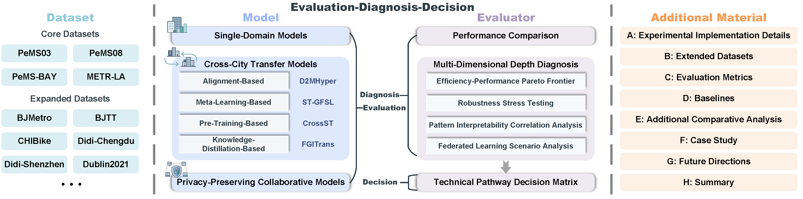

# 🏙️ CrossCityBench: A Comprehensive Benchmark for Cross-City Spatio-Temporal Traffic Prediction

  

## 🏆 Contribution

  
   
  <strong>The CrossCityBench Architecture</strong>

 

This paper proposes CrossCityBench, a benchmark framework for cross-city traffic prediction, with its core work structured around a three-tier logic of "**Evaluation-Diagnosis-Decision**".

- **Evaluation**: A unified evaluation system is constructed, systematically categorizing methods into single-domain models, cross-city transfer models (including alignment-based, meta-learning-based, pre-training-based, and knowledge distillation-based strategies), and privacy-preserving collaborative models.
  
- **Diagnosis**: Based on multi-dimensional in-depth diagnostics, model behaviors are analyzed in terms of efficiency, robustness, interpretability, and collaboration costs in federated learning scenarios, revealing their characteristics under challenges such as data scarcity and distribution shifts.
  
- **Decision**: Experimental findings are synthesized into a pathway matrix, providing well-founded guidance for method selection and deployment trade-offs in practical scenarios.
  
All analyses are supported by a complete set of supplementary materials (including experimental details, extended datasets, evaluation metrics, baseline methods, case studies, etc.), ensuring the reproducibility of the research and the comprehensiveness of the conclusions. Through systematic evaluation, diagnosis, and decision support, this framework promotes the practical adoption and paradigm evolution of cross-city prediction models.

## 💾 Datasets

### Core Datasets

<b>Table 1: The overview of core datasets</b>

|  Datasets  |     Tasks      | #Nodes |   Interval   | Time Span (min) |
|:---------:|:-------------:|:--------:|:-------------:|:--------:|
| PeMS03    | Traffic Flow  | 358      | 5 min| 131,040    |
| PeMS08    | Traffic Flow  | 170      | 5 min| 89,280    |
| PeMS-BAY  | Traffic Speed | 325      | 5 min| 217,440    |
| METR-LA   | Traffic Speed | 207      | 5 min| 175,680    |

Core datasets (PeMS03, PeMS08, PeMS-BAY, and METR-LA) are available at [Google Drive](https://drive.google.com/file/d/1oPLRyEN32peSLWLVNVcropHt5iBNUQxo).

### Extended Datasets

<b>Table 2: The overview of extended datasets</b>

| Datasets | #Nodes | Interval | Time Span (min) | Datasets | #Nodes | Interval | Time Span (min) |
|:---:|:---:|:---:|:---:|:---:|:---:|:---:|:---:|
| BJMetro | 276 | 10min | 47,520 | BJTT | 1260 | 5min | 11,160 |
| CHIBike | 270 | 30min | 132,480 | Didi-Chengdu | 524 | 10min | 17,280 |
| Didi-Shenzhen | 627 | 10min | 17,280 | Dublin2021 | 33 | 5min | 105,120 |
| England | 248 | 15min | 260,640 | HKData | 617 | 5min | 89,280 |
| HZMetro | 80 | 15min | 36,000 | Los-Loop | 207 | 5min | 44,640 |
| NE-BJ | 500 | 5min | 44,640 | NYCBike | 250 | 30min | 131,040 |
| NYCTaxi | 266 | 30min | 131,040 | PeMS04 | 307 | 5min | 16,992 |
| PeMS07 | 228 | 5min | 12,672 | PeMSD7(L) | 1026 | 5min | 87,840 |
| PeMSD7(M) | 228 | 5min | 87,840 | PeMS-Rainy | 308 | 5min | 105,120 |
| Seattle-Loop | 323 | 5min | 525,600 | SHMetro | 288 | 15min | 132,480 |
| SZ-Taxi | 156 | 5min | 44,640 | T-Drive | 1024 | 60min | 216,000 |
| WHBT | 251 | 5min | 50,400 | XMBRT | 44 | 5min | 37,440 |

## Taxonomy of Learning Paradigms and the Benchmark Model Zoo

<b>Table 3: Taxonomy of learning paradigms and the benchmark model zoo</b>

<table align="center">
  <thead>
    <tr>
      <th align="center">Categories</th>
      <th align="center">Sub-Categories</th>
      <th align="center">Guiding Principles</th>
      <th align="center">Representative Methods</th>
      <th align="center">Key Strengths</th>
      <th align="center">Primary Challenges</th>
    </tr>
  </thead>
  <tbody>
    <tr>
      <td align="center" rowspan="1"><strong>Single-Domain Models</strong></td>
      <td align="center">—</td>
      <td align="center">Learn city-specific dynamics without transfer</td>
      <td align="center">GBRT, VAR, AGCRN, AllDeepSet, DCRNN, DyHSL, GRU, GWNet, STGCN, STG-NCDE</td>
      <td align="center">No cross-city bias</td>
      <td align="center">Performance degrades under data scarcity</td>
    </tr>
    <tr>
      <td align="center" rowspan="4"><strong>Cross-City Transfer Models</strong></td>
      <td align="center"><em>Alignment-based transfer</em></td>
      <td align="center">Explicitly align source-target distributions</td>
      <td align="center">DASTNet, D2MHyper, DAGN, ST-DAAN</td>
      <td align="center">Mitigates moderate distribution shifts</td>
      <td align="center">Sensitive to large heterogeneity; alignment cost</td>
    </tr>
    <tr>
      <td align="center"><em>Meta-learning-based transfer</em></td>
      <td align="center">Learn-to-adapt rapidly with few examples</td>
      <td align="center">MAML, ST-GFSL</td>
      <td align="center">Fast adaptation to new cities</td>
      <td align="center">Requires diverse meta-tasks; unstable optimization</td>
    </tr>
    <tr>
      <td align="center"><em>Pre-training-based transfer</em></td>
      <td align="center">Learn transferable representations from multi-city data</td>
      <td align="center">CrossST, MTPB, STGCN-FT</td>
      <td align="center">Strong generalization; scalable</td>
      <td align="center">Needs large pre-training corpus; catastrophic forgetting</td>
    </tr>
    <tr>
      <td align="center"><em>Knowledge-distillation-based transfer</em></td>
      <td align="center">Compress teacher knowledge into a lightweight student</td>
      <td align="center">FGITrans</td>
      <td align="center">Efficient deployment</td>
      <td align="center">Teacher-student capability gap; distillation loss</td>
    </tr>
    <tr>
      <td align="center" rowspan="1"><strong>Privacy-Preserving Collaborative Models</strong></td>
      <td align="center">—</td>
      <td align="center">Collaborate without sharing raw data</td>
      <td align="center">FedCTPM, pFedCTP, FedGTP</td>
      <td align="center">Addresses scarcity and privacy jointly</td>
      <td align="center">Communication overhead; client heterogeneity</td>
    </tr>
  </tbody>
</table>

## STPB Specification and Interpretability Validation

To ensure the reproducibility and validity of the interpretability analysis, the construction and validation of STPB proceeds in three clearly defined steps.

**Prototype Construction:** Extract pattern segments from PeMS03 and PeMS-BAY datasets. Perform K-means clustering on normalized pattern embeddings.

**Prototype Selection:** Determine the number of clusters using the elbow method. Retain only prototypes that appear in more than 70\% of cities, ensuring generality.

**Interpretability Validation:** Conduct a user study with 5 domain experts. Each expert rates interpretability (scale 1--5) based on model outputs. Compute correlation between STPB similarity and human ratings.

<b>Table 4: Formal specification of STPB prototypes</b>

| Item                     | Setting                                                                 |
|:------------------------:|:-----------------------------------------------------------------------:|
| Prototype source data    | Pattern segments extracted from **PeMS03 + PeMS-BAY**                   |
| Candidate pattern pool   | Trend, periodicity, peak-shift, burstiness, local fluctuation segments |
| Prototype construction   | **K-means clustering** on normalized pattern embeddings                |
| Number of clusters \(K\) | **8**                                                                   |
| K selection criterion    | **Elbow method** on within-cluster SSE                                 |
| Prototype retention rule | Retain prototypes appearing in **>70%** of cities                       |
| Final prototype bank size| **8 prototypes**                                                        |
| Similarity metric        | Average cosine similarity between model representation and prototype vectors |

<b>Table 5: STPB vs. human interpretability</b>

| Model      | STPB Similarity | Expert Rating (1-5) | Rank by STPB | Rank by Experts |
|:----------:|:--------------:|:-------------------:|:------------:|:---------------:|
| D2MHyper   | 0.0743          | 4.4 ± 0.3           | 1            | 1               |
| CrossST    | 0.0227          | 3.8 ± 0.5           | 2            | 2               |
| FGITrans   | -0.0226         | 3.1 ± 0.4           | 3            | 3               |
| ST-LLM+    | -0.0268         | 2.9 ± 0.6           | 4            | 4               |
| ST-GFSL    | -0.0368         | 2.6 ± 0.4           | 5            | 5               |
| DyHSL      | -0.0473         | 2.5 ± 0.5           | 6            | 6               |

<b>Table 6: Statistical validity of STPB</b>

| Metric                       | Value   |
|:---------------------------:|:-------:|
| Pearson $r$                | **0.79**|
| p-value                      | **0.008**|
| Spearman $\rho$            | **0.74**|
| p-value                      | **0.014**|
| Intraclass Correlation Coefficient (ICC)  | **0.81**|

**Results Analysis**

(1) **STPB is now clearly defined.** As shown in Table 4, the prototype bank is constructed via K-means ($K=8$, elbow method) on patterns from PeMS03 + PeMS-BAY, with a $>70\%$ cross-city filtering rule. This makes STPB fully specified and reproducible, addressing the concern about undefined $K$, construction, and selection.

(2) **STPB correlates well with human interpretability.** From Tables 5-6, STPB similarity is strongly aligned with expert ratings (Pearson $r = 0.79$, $p < 0.01$), and the model rankings are fully consistent. This validates STPB as a reliable interpretability proxy.

(3) **STPB captures meaningful differences across models.** Models such as D2MHyper and CrossST achieve higher STPB scores and human ratings, while others are lower, showing that STPB can effectively distinguish interpretability across methods.

## The Technical Pathway Decision Matrix for Cross-City Traffic Prediction

<b>Table 7: The technical pathway decision matrix for cross-city spatio-temporal traffic prediction</b>

<table align="center">
  <thead>
    <tr>
      <th align="center">Constraints</th>
      <th align="center">Primary Goals</th>
      <th align="center">Paradigms</th>
      <th align="center">Example Models</th>
      <th align="center">Key Limitations</th>
      <th align="center">Quantitative References</th>
    </tr>
  </thead>
  <tbody>
    <tr>
      <td align="left">Large distribution shift (Δℳ_shift > 25%)</td>
      <td align="left">Optimal accuracy</td>
      <td align="left">Alignment</td>
      <td align="left">D2MHyper</td>
      <td align="left">Needs source data; Unstable training</td>
      <td align="left">High Δℳ_shift (Figure 8(b))</td>
    </tr>
    <tr>
      <td align="left">Extreme data scarcity (target training days &lt; 3)</td>
      <td align="left">Fast adaptation</td>
      <td align="left">Meta-learning</td>
      <td align="left">ST-GFSL</td>
      <td align="left">High meta-training cost; Task-sensitive</td>
      <td align="left">High latency (Figure 9); Robustness (Section 4.3)</td>
    </tr>
    <tr>
      <td align="left">Multi-source data available</td>
      <td align="left">Zero-shot robustness</td>
      <td align="left">Pre-training</td>
      <td align="left">CrossST</td>
      <td align="left">High pre-training resource cost</td>
      <td align="left">High memory use (Figure 9); Robustness (Section 4.3)</td>
    </tr>
    <tr>
      <td align="left">Deployment efficiency critical (latency &lt; 0.5s)</td>
      <td align="left">Efficient inference</td>
      <td align="left">Distillation</td>
      <td align="left">FGITrans</td>
      <td align="left">Teacher-dependent</td>
      <td align="left">Low latency, small size (Figure 9)</td>
    </tr>
    <tr>
      <td align="left">Privacy constraints (no data sharing)</td>
      <td align="left">Privacy-preserving performance</td>
      <td align="left">Federated learning</td>
      <td align="left">FedCTPM</td>
      <td align="left">Communication cost; Utility gap</td>
      <td align="left">Communication overhead and 𝒢_util (Section 4.4)</td>
    </tr>
    <tr>
      <td align="left">Ample resources (high compute budget)</td>
      <td align="left">Competitive zero-shot accuracy</td>
      <td align="left">Foundation model (zero-shot/fine-tune)</td>
      <td align="left">UniST, UrbanGPT, ST-LLM+</td>
      <td align="left">5–10× higher latency; 10–20× larger GPU memory</td>
      <td align="left">MAE 16.71–17.89 vs. CrossST 16.25 (PeMS03→08)</td>
    </tr>
  </tbody>
</table>

